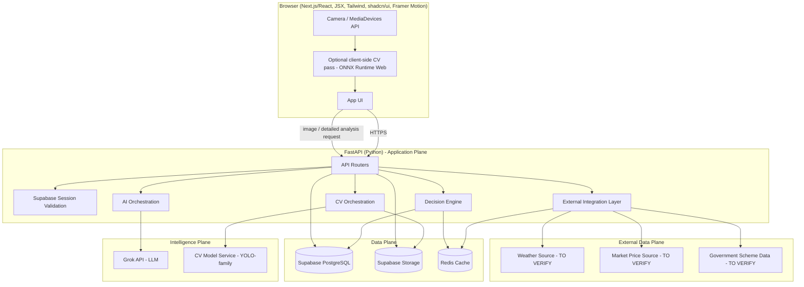
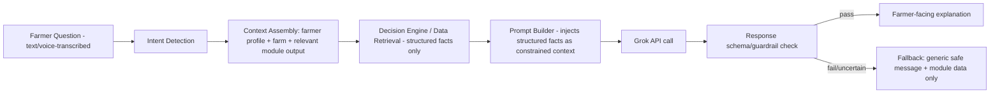
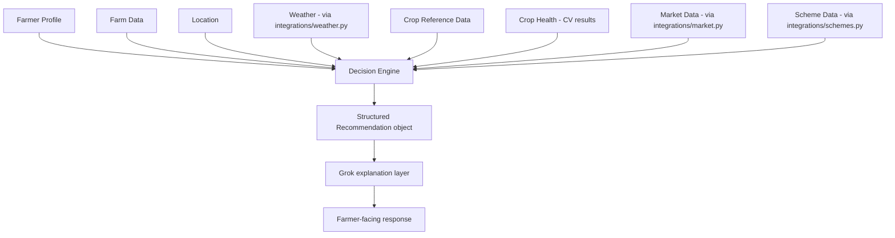
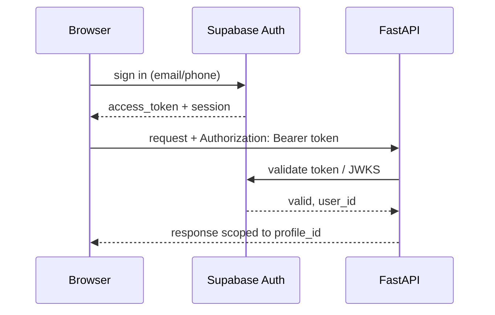
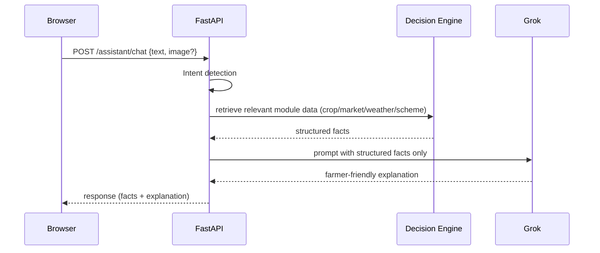
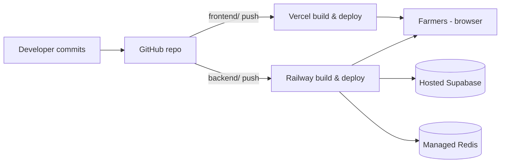
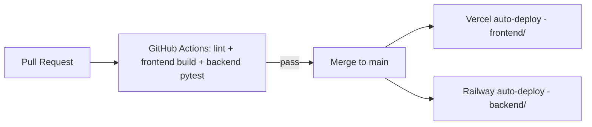

# FasalAI — Technical Stack & System Architecture Document
### PR·FUSION · AI Personalized Agriculture Decision Support Platform
### Team Genzcoderz (NXH036) · NEXORA 2026 Innovation Hackathon · KES B.K. Shroff M.H. Shroff College

**Document status:** Implementation-ready v1.0
**Companion document:** FasalAI Product Requirements Document (PR·FUSION PRD)
**Audience:** Hackathon dev team and any AI coding agent implementing this system

**Labeling convention:**
- **[CONFIRMED]** — fixed by the non-negotiable stack in the brief; must not be changed
- **[PROPOSED]** — a design decision made by this document, open to team refinement
- **[TO VERIFY]** — any external API, dataset, model version, or numeric target that must be confirmed before/during build
- **[FUTURE]** — explicitly out of MVP scope

---

## 1. Executive Technical Summary

FasalAI is a single, responsive Next.js/React web application backed by a FastAPI service layer, Supabase (Postgres + Auth + Storage), and Redis caching. Grok is the sole LLM provider and is used strictly for language understanding, explanation, and personalization — never as a source of factual agricultural data. Disease/crop-health detection is handled by a dedicated computer-vision pipeline (YOLO-family or equivalent), architecturally separate from the LLM. All decision logic (crop suitability, eligibility, market comparison, risk/sustainability scoring) lives in a deterministic **Decision Engine** inside FastAPI; Grok is only ever called *after* the Decision Engine has produced structured output, to translate that output into farmer-friendly language.

The system is built and deployed with a small hackathon team in mind: Next.js on Vercel, FastAPI on Railway, hosted Supabase, and a managed Redis instance — no Kubernetes, no microservices, no blockchain, no native mobile apps.

**Core architectural rule, restated:**
```
NOT:  Farmer → LLM → Answer
YES:  Farmer Input → FastAPI → Data Retrieval → Decision Engine → CV (if image) → Grok Explanation → Farmer
```

---

## 2. Technology Stack (Non-Negotiable)

| Layer | Technology | Purpose | Why |
|---|---|---|---|
| Frontend | Next.js | Web application | Responsive React framework |
| UI | React + JSX | UI development | Required frontend technology — **no TypeScript** |
| Styling | Tailwind CSS | Styling | Responsive utility-first styling |
| Components | shadcn/ui | UI components | Accessible reusable components, used selectively |
| Animation | Framer Motion | UX animation | Smooth interactions |
| Backend | FastAPI | REST API / backend | Python AI/data integration |
| Database | Supabase PostgreSQL | Persistent data | Relational data |
| Auth | Supabase Auth | Authentication | Managed authentication |
| Storage | Supabase Storage | Images/documents | Managed object storage |
| Cache | Redis | Caching | Fast temporary data |
| AI | Grok API | LLM | Conversational AI and explanations |
| CV | YOLO-family / equivalent **[TO VERIFY exact model/version]** | Disease detection | Real-time vision |
| Camera | Browser MediaDevices API | Camera access | Real-time scanning |
| Version Control | Git | Source control | Development workflow |
| Repository | GitHub | Code hosting | Collaboration + CI/CD |
| Frontend Deployment | Vercel | Next.js hosting | Optimized deployment |
| Backend Deployment | Railway | FastAPI hosting | Simple backend deployment |
| Testing | Jest / RTL / Pytest / Playwright | Testing | Quality assurance |
| Monitoring | Sentry **[PROPOSED, optional]** | Error monitoring | Production visibility |

This table is authoritative. No layer in it should be substituted elsewhere in this document.

---

## 3. Architecture Overview

FasalAI has five architectural planes, kept strictly separate:

1. **Presentation plane** — Next.js/React app, responsive, mobile-first.
2. **Application/API plane** — FastAPI, owns all business logic, validation, orchestration, and is the only layer permitted to call external/secret-bearing services.
3. **Intelligence plane** — split into two independent sub-systems: (a) the deterministic **Decision Engine** (rules + scoring) and (b) two AI providers: **Grok** (language) and a **CV model** (vision). Neither AI provider is allowed to originate factual claims that belong to the Decision Engine or a verified data source.
4. **Data plane** — Supabase Postgres (system of record), Supabase Storage (images/documents), Redis (cache/short-lived state).
5. **External data plane** — weather, market price, and government scheme sources, all proxied and normalized through FastAPI, never called directly by the browser.

**Golden rule:** the browser talks only to Next.js/FastAPI. FastAPI is the only component permitted to hold or use secret credentials (Grok key, Supabase service-role key, external API keys, Redis credentials).

## 4. Architecture Diagram



---

## 5. Frontend Architecture

**Stack [CONFIRMED]:** Next.js (App Router **[PROPOSED]**), React, JavaScript/JSX only (no TypeScript), Tailwind CSS, shadcn/ui (used selectively, not forced), Framer Motion for transitions/micro-interactions.

**Responsive strategy:** Mobile-first Tailwind breakpoints (`sm/md/lg/xl`), single responsive codebase — no separate mobile/desktop builds. The Crop Scanner screen is optimized for a mobile portrait camera viewport but must also support desktop webcam + file upload as an equivalent path.

**State management [PROPOSED]:** No global state library (Redux/Zustand/etc.) is introduced by default. Use React state + Context only for: (a) authenticated user/session, (b) active farm/profile context, (c) language preference. If a screen's local complexity genuinely outgrows this (e.g., the multi-step Crop Scanner + live overlay state), a lightweight library may be introduced **only for that feature**, with justification documented in code comments — never as a blanket app-wide addition.

**Folder structure:**
```
frontend/
├── app/                        # Next.js App Router routes (screens from Section 44 of PRD)
│   ├── (auth)/login/
│   ├── (auth)/register/
│   ├── onboarding/
│   ├── farm-setup/
│   ├── dashboard/
│   ├── crops/recommendations/
│   ├── crops/compare/
│   ├── scanner/
│   ├── scanner/result/
│   ├── crop-health/
│   ├── weather/
│   ├── market/
│   ├── market/compare/
│   ├── schemes/
│   ├── schemes/[id]/
│   ├── assistant/
│   ├── alerts/
│   ├── settings/
│   └── layout.js
├── components/                 # Reusable, presentation-only UI (shadcn wrappers, cards, badges)
├── features/                   # Feature-scoped logic + components (crop-scanner/, market/, schemes/, assistant/)
├── hooks/                      # useAuth, useFarmProfile, useCamera, useVoiceInput, etc.
├── lib/                        # Supabase client init, Grok-safe API wrapper (never direct Grok calls), constants
├── services/                   # Typed-by-convention API client functions calling FastAPI endpoints (Section 9)
├── utils/                      # formatting, validation, i18n helpers
├── styles/                     # Tailwind config, globals
├── public/                     # static assets, icons
└── middleware.js                # route protection based on Supabase session
```

**Routing/layouts:** Root layout provides language + auth context; a protected-route layout wraps all farmer screens and redirects unauthenticated users to `/login`. Bottom navigation (5 destinations per PRD Section 13) rendered in the protected layout for mobile widths; converts to a top/side nav at `lg+` breakpoints.

**API client:** All backend calls go through `services/api.js`, a thin `fetch`/axios wrapper that attaches the Supabase access token as `Authorization: Bearer <token>` and centralizes error handling (Section 21 below). No frontend code calls Grok, the CV model service, weather, market, or scheme APIs directly — everything routes through this client to FastAPI.

**Authentication handling:** Supabase JS client manages sign-up/login/logout/session refresh client-side (`NEXT_PUBLIC_*` keys only — see Section 28). The resulting session access token is forwarded to FastAPI on every request; FastAPI independently validates it (Section 7) rather than trusting the client.

**Error/loading states:** Each route/feature implements Next.js `loading.js` (skeleton) and `error.js` (retry) boundaries; API client normalizes backend error responses into a consistent `{ code, message, retryable }` shape consumed by a shared `<ErrorState/>` component.

---

## 6. Backend Architecture

**Stack [CONFIRMED]:** FastAPI, Python.

**Folder structure:**
```
backend/
├── app/
│   ├── api/                    # Route definitions (thin controllers), versioned e.g. api/v1/
│   │   ├── auth.py
│   │   ├── farmer.py
│   │   ├── farm.py
│   │   ├── crops.py
│   │   ├── scanner.py
│   │   ├── weather.py
│   │   ├── market.py
│   │   ├── schemes.py
│   │   ├── assistant.py
│   │   └── alerts.py
│   ├── core/                   # Config, settings (env parsing), security (JWT/session validation), rate limiting
│   ├── models/                 # ORM/DB row models (SQLAlchemy or Supabase-py mapped models)
│   ├── schemas/                # Pydantic request/response schemas — single source of API contract truth
│   ├── services/                # Use-case orchestration per domain (crop_service.py, market_service.py, ...)
│   ├── repositories/            # DB access layer (Postgres via Supabase) — isolates SQL/query logic from services
│   ├── ai/                     # Grok client wrapper, prompt templates, response schema enforcement
│   ├── cv/                     # CV model client wrapper, pre/post-processing, confidence thresholding
│   ├── decision_engine/         # Deterministic scoring/rules: crop suitability, eligibility, market comparison, risk/sustainability
│   ├── integrations/            # External data source adapters: weather.py, market.py, schemes.py (each isolates one TO VERIFY source)
│   └── main.py                  # App factory, router registration, middleware (CORS, rate limit, error handlers)
├── tests/
└── requirements.txt
```

**Layer responsibilities:**
- **api/** — HTTP concerns only (parse request, call a service, return schema-validated response). No business logic here.
- **core/** — cross-cutting concerns: settings, Supabase session validation, rate limiting, logging.
- **schemas/** — Pydantic models define every request/response contract (Section 9 of this doc gives examples); used for both validation and auto-generated OpenAPI docs.
- **services/** — orchestrate a use case: call repositories, the decision engine, AI/CV, and integrations, and assemble the final response. This is where the "Farmer Input → ... → Farmer" pipeline (Section 3 principle) is actually implemented.
- **repositories/** — the only layer that talks to Postgres directly (via Supabase client or SQLAlchemy), keeping SQL out of services.
- **ai/** — the *only* place Grok is called from; enforces a strict response schema so Grok cannot silently inject unverified facts (see Section 10).
- **cv/** — the *only* place the CV model service is called from; owns confidence-threshold logic (PRD Module D).
- **decision_engine/** — pure, testable, deterministic Python: crop suitability scoring, eligibility rule evaluation, market net-return calculation, sustainability/risk scoring. No network calls inside this package.
- **integrations/** — one adapter per external source, each responsible for calling the source, normalizing its response into internal schemas, and writing through to Redis cache.

**Authorization model:** every authenticated request resolves to a `farmer_id`; repositories always scope queries by `farmer_id` (defense in depth alongside Supabase RLS, Section 7).

---

## 7. Database Architecture (Supabase PostgreSQL)

| Table | Key Columns | Notes |
|---|---|---|
| `profiles` | `id (PK, = auth.users.id)`, `full_name`, `phone`, `language`, `role`, `created_at` | 1:1 with Supabase Auth user |
| `farms` | `id (PK)`, `profile_id (FK→profiles)`, `land_size_acres`, `soil_type`, `irrigation`, `water_source`, `budget`, `risk_preference`, `created_at`, `updated_at` | 1:N per profile |
| `farm_locations` | `id (PK)`, `farm_id (FK, unique)`, `lat`, `lng`, `state`, `district`, `taluka`, `village` | 1:1 with `farms` |
| `soil_profiles` | `id (PK)`, `farm_id (FK)`, `source ('farmer_input'|'regional_default')`, `attributes (jsonb)` | Supports fallback-default logic (PRD edge cases) |
| `crop_cycles` | `id (PK)`, `farm_id (FK)`, `crop_id (FK→crops)`, `start_date`, `status`, `is_current (bool)` | 1:N per farm; supports multiple concurrent crops |
| `crops` | `id (PK)`, `name`, `water_need`, `season`, `typical_duration_days` | Reference table |
| `crop_scans` | `id (PK)`, `crop_cycle_id (FK)`, `image_path (Supabase Storage ref)`, `captured_at`, `status`, `confidence`, `disease_result_id (FK, nullable)` | Indexed on `crop_cycle_id, captured_at` |
| `disease_results` | `id (PK)`, `name`, `symptoms (jsonb)`, `causes (jsonb)`, `recommended_actions (jsonb)`, `severity_scale` | Reference/knowledge table |
| `recommendations` | `id (PK)`, `profile_id (FK)`, `type ('crop'|'spray'|'market'|'scheme')`, `payload (jsonb)`, `confidence`, `generated_at` | Append-only log, indexed on `profile_id, generated_at desc` |
| `markets` | `id (PK)`, `name`, `lat`, `lng`, `district` | Reference table |
| `market_prices` | `id (PK)`, `market_id (FK)`, `crop_id (FK)`, `price`, `unit`, `date` | Indexed on `(crop_id, market_id, date)` |
| `government_schemes` | `id (PK)`, `name`, `level ('central'|'state')`, `purpose`, `benefits`, `documents (jsonb)`, `deadline`, `source_url`, `last_verified_at` | Curated/admin-managed |
| `scheme_eligibility_rules` | `id (PK)`, `scheme_id (FK)`, `criterion`, `comparator`, `value` | Evaluated by Decision Engine, not stored per-farmer |
| `alerts` | `id (PK)`, `profile_id (FK)`, `type`, `message`, `relevance_reason`, `sent_at`, `read_at (nullable)` | Indexed on `profile_id, sent_at desc` |
| `conversations` | `id (PK)`, `profile_id (FK)`, `created_at` | 1:N `messages` |
| `messages` | `id (PK)`, `conversation_id (FK)`, `role ('farmer'|'assistant')`, `content`, `attachments (jsonb, nullable)`, `created_at` | Grok conversation metadata only — never stores raw secret data |

**Constraints/indexes [PROPOSED]:** FKs with `ON DELETE CASCADE` from `farms`→`profiles`, `crop_cycles`→`farms`, etc.; `created_at`/`updated_at` timestamps with defaults on every table; composite index on `market_prices(crop_id, market_id, date desc)` for fast "current price" lookups; index on `crop_scans(crop_cycle_id, captured_at desc)` for health timeline queries.

**Avoided tables:** no separate `weather` table — weather is fetched live/cached in Redis, not persisted long-term, since it is highly time-decaying data (PRD explicitly scopes `weather_cache_metadata` as "where appropriate" — this document treats full weather history as unnecessary for MVP).

---

## 8. Authentication Architecture (Supabase Auth)

- **Registration/login/logout/password reset/session management:** handled entirely by Supabase Auth via the frontend Supabase JS client using `NEXT_PUBLIC_SUPABASE_URL` / `NEXT_PUBLIC_SUPABASE_ANON_KEY` (safe to expose — anon key is designed for client use under RLS).
- **Session validation in FastAPI:** every protected FastAPI route requires an `Authorization: Bearer <supabase_access_token>` header. FastAPI validates this token against Supabase (via the Supabase Python client or by verifying the JWT signature using Supabase's JWKS/secret, **[TO VERIFY exact validation method against current Supabase SDK]**) and resolves it to a `profile_id`. FastAPI never re-implements password handling — it only verifies sessions Supabase already issued.
- **Row Level Security (RLS):** enabled on every farmer-owned table (`farms`, `farm_locations`, `crop_cycles`, `crop_scans`, `recommendations`, `alerts`, `conversations`, `messages`) with policies scoping rows to `auth.uid() = profile_id` (directly or via join). Reference tables (`crops`, `markets`, `market_prices`, `government_schemes`, `scheme_eligibility_rules`, `disease_results`) are read-only to authenticated users and writable only via the service-role key (admin/back-office path, not exposed to farmers).
- **Service-role key usage:** used **only** server-side in FastAPI for admin/reference-data operations (e.g., updating `government_schemes`); never sent to the browser.

---

## 9. Redis Architecture

**Purpose:** cache and short-lived state only — never the system of record.

| Cache Key Pattern | TTL [PROPOSED] | Notes |
|---|---|---|
| `weather:{lat}:{lng}:{date}` | 30–60 min | Weather changes slowly enough that a short TTL balances freshness vs. API cost; forecast data may use a longer TTL (e.g., 3 hrs) for multi-day views |
| `market:{crop_id}:{market_id}:{date}` | 6–24 hrs | Mandi/market prices typically update daily; cache-aside with daily invalidation |
| `schemes:{state}:{district}` | 12–24 hrs | Scheme data changes infrequently; safe to cache longer |
| `ratelimit:{profile_id}:{endpoint}` | Sliding window, e.g. 60s–1hr | Used for rate limiting (Section 21), not a cache of business data |
| `dedupe:{profile_id}:{request_hash}` | Seconds–minutes | Request deduplication for rapid duplicate submissions (e.g., double-tap "Scan") |

**Pattern:** cache-aside. On read: check Redis → on miss, call the integration adapter → normalize → write to Redis with TTL → return. On external-source failure: serve last-known Redis value if present, marked `stale: true` in the response payload (feeds PRD's "stale data" UI states) rather than failing the request outright.

**Do NOT cache:** Grok conversational responses containing farmer-specific personal data or advice tied to a specific recommendation (each answer should reflect current state, not a stale cached one); raw farmer profile/PII; authentication tokens/sessions (Supabase owns session lifecycle, not Redis).

**Invalidation:** profile/farm updates that affect a cached recommendation invalidate any dependent `recommendation:*` cache key **[PROPOSED, if recommendation caching is added]**; market/weather/scheme caches rely on TTL expiry rather than manual invalidation, since they are sourced from external systems FastAPI does not control.

---

## 10. AI Architecture (Grok)

**Placement:** `backend/app/ai/` is the only code permitted to call the Grok API. The `GROK_API_KEY` never leaves the backend.



**Responsibilities delegated to Grok:** conversational NLU/intent parsing assistance, converting structured Decision Engine output into farmer-friendly language, summarization, multilingual phrasing **[TO VERIFY Grok's supported languages against MVP language list]**, scheme text simplification.

**Responsibilities explicitly NOT delegated to Grok:** crop suitability scores, disease diagnosis, market prices, scheme eligibility verdicts, weather data — all of these are computed/retrieved by the Decision Engine, CV pipeline, or integration adapters, and passed *into* Grok as read-only context. The prompt template instructs Grok to explain and phrase only what it is given, and the response is checked against expected structure before being returned to the frontend.

**Guardrail mechanism [PROPOSED]:** function-calling / structured-output mode (if supported by the Grok API, **[TO VERIFY]**) constrains Grok to reference only fields present in the supplied context object; if structured mode isn't available, a strict system prompt plus a post-response validator (checking that no new numeric claims appear that weren't in the input context) is used instead.

**Failure handling:** if the Grok API call fails or times out, the backend still returns the Decision Engine's structured recommendation (numbers, scores, statuses) with a simpler templated explanation instead of the AI-generated one — the app must never become unusable just because Grok is down.

---

## 11. Computer Vision Architecture

**Placement:** `backend/app/cv/` orchestrates calls to a dedicated CV Model Service (could be a Python inference process/microservice colocated with or adjacent to FastAPI — **[PROPOSED, exact hosting TBD]**). The CV model is architecturally independent of Grok; FastAPI, not the LLM, is the disease detector.

**Model approach:** a YOLO-family or equivalent real-time object detection/classification model **[TO VERIFY exact model + version + training/fine-tuning source]**, wrapped behind a stable internal interface (`detect(image) -> {crop, disease, pest, confidence, bounding_boxes, severity}`) so the underlying model can be swapped/upgraded without changing calling code.

**Two-stage pipeline:**
1. **Real-time/live detection** — lightweight, low-latency pass used while the camera is active, to give the farmer immediate visual feedback (bounding boxes / status chip) as they aim the camera.
2. **Detailed analysis** — once the farmer captures a still image, that image (plus the stage-1 structured result, if any) is sent to FastAPI's `cv/` module for a more thorough pass, producing the full Diagnosis Result payload (confidence, severity, symptoms, causes, recommended actions) per PRD Module D.

**Confidence thresholding [PROPOSED threshold: 60%, TO VERIFY against real model evaluation]:** below threshold, `cv/` returns a standardized low-confidence payload; the API layer maps this directly to the PRD's required uncertainty message rather than fabricating a diagnosis.

---

## 12. Real-Time Camera Architecture

**Client-side capture:** the browser `MediaDevices.getUserMedia` API opens the device camera into a `<video>` element; frames are periodically drawn to an offscreen `<canvas>` for processing — the raw video stream itself is never uploaded continuously.

**Frame sampling strategy [PROPOSED]:** rather than processing every frame, sample at a fixed interval (e.g., every 500ms–1s, **[TO VERIFY against target device performance]**), with a simple debounce so a detection result must be confirmed across 2 consecutive sampled frames before updating the on-screen status, avoiding flicker.

**Where inference runs — explicit tradeoff:**

| Approach | Latency | Cost/Infra | Accuracy Ceiling | When Used |
|---|---|---|---|---|
| Client-side (ONNX Runtime Web / WebAssembly / WebGPU — **[PROPOSED, optional]**, small quantized model) | Lowest, no round-trip | No server compute cost per frame; larger client bundle | Lower (must be a lightweight model) | Live/real-time overlay while aiming the camera |
| Backend inference (FastAPI → CV Model Service) | Higher (network round-trip) | Server compute cost per request | Higher (full-size model) | Detailed analysis on the captured still image |

This hybrid is **[PROPOSED]**, not mandatory: if client-side inference proves impractical within hackathon time, the live-overlay stage may fall back to a lower-frequency backend polling loop on captured frames instead — the architecture must not assume high-end client GPU hardware (Section 22 below) and should degrade gracefully to "capture-then-analyze" only if live overlay isn't feasible in time.

**User flow:** Open Scanner → grant camera permission → live feed renders → (optional) live low-confidence overlay updates every sampling interval → farmer taps "Capture" → still frame uploaded to FastAPI `cv/` for detailed analysis → Diagnosis Result screen.

**Fallback:** if camera permission is denied or unavailable (desktop without webcam), the Scanner screen offers a file-upload path into the same detailed-analysis backend endpoint — one unified result flow regardless of capture method.

---

## 13. Decision Engine Architecture

**Location:** `backend/app/decision_engine/` — pure Python, no network calls, fully unit-testable.



**Sub-modules:**
- **Crop suitability scorer** — rule-based hard filters (e.g., exclude crops needing irrigation if `irrigation = false`) + weighted scoring across soil match, season match, water fit, budget fit, market conditions, risk preference, sustainability weight → 0–100 suitability score with a machine-readable list of contributing factors (used to build the "Why this?" explanation, both templated and Grok-phrased).
- **Cost/yield/revenue/profit estimator** — deterministic formulae using crop reference data × farm inputs × current market price; every output field tagged `is_estimate: true` in the schema so the frontend cannot accidentally render it as a guarantee.
- **Market comparator** — `estimated_net_return = (price × expected_quantity) − estimated_transport_cost`; ranks nearby markets; degrades to price+distance-only ranking if transport-cost data is unavailable, with that degradation flagged in the response.
- **Eligibility evaluator** — evaluates each `scheme_eligibility_rules` row against the farmer/farm record; outputs `likely_eligible | more_info_required | unlikely_eligible` plus the specific criterion driving that verdict.
- **Sustainability/risk scorer** — explainable scoring function (documented formula, not a black box) combining water efficiency, rotation fit, and chemical-usage assumptions from crop reference data.

**Output contract:** every Decision Engine function returns a structured object with `{value(s), confidence, factors[], data_freshness{source, as_of}, is_estimate}` — this is the *only* input Grok's explanation layer is allowed to read from for that recommendation.

---

## 14. Weather Integration

**Adapter:** `backend/app/integrations/weather.py`. Fetches from a weather data source **[TO VERIFY exact provider]**, normalizes into an internal schema `{temperature, rain_probability, rainfall, humidity, wind, forecast[], alerts[]}`, writes through Redis (`weather:{lat}:{lng}:{date}`, TTL per Section 9).

**Decision translation:** the Decision Engine (not the adapter) maps weather conditions to farming actions — e.g., `rain_probability_tomorrow > threshold [TO VERIFY threshold] → recommend delaying spraying`. This mapping lives in `decision_engine/weather_rules.py` as an explicit, testable rule set, not inside a prompt to Grok.

**Failure handling:** on adapter failure, serve last cached value marked `stale: true`; if no cached value exists, the weather-dependent portion of the dashboard shows an explicit "weather unavailable" empty state rather than blocking the rest of the response.

## 15. Market Integration

**Adapter:** `backend/app/integrations/market.py`. Fetches current/nearby/historical prices from a market price source **[TO VERIFY exact provider — likely a government mandi price dataset/API]**, normalized into `market_prices` rows (persisted, since price history has ongoing value) and cached in Redis for the "current price" hot path.

**Net-return calculation:** performed by the Decision Engine's market comparator (Section 13), not by this adapter — the adapter's job is strictly fetch + normalize + persist + cache.

**MVP fallback [PROPOSED]:** if a verified live market API cannot be integrated within hackathon time, this adapter reads from a curated demo dataset seeded into `market_prices` directly, structurally identical to what a live integration would produce, so swapping in a real source later requires no changes to the Decision Engine or API layer — only to this one adapter file.

## 16. Government Scheme Integration

**Adapter:** `backend/app/integrations/schemes.py`. Government scheme content (`government_schemes`, `scheme_eligibility_rules`) is treated as **curated reference data**, not a live-generated feed — it is populated/updated by an admin process (manual entry or a periodic scrape/import job **[TO VERIFY]**), never invented by Grok. Each scheme row carries `last_verified_at` and `source_url`, both surfaced to the farmer per PRD requirements.

**Eligibility flow:** `schemes.py` fetches the relevant scheme set for a farmer's state/district (cached per Section 9); the Decision Engine's eligibility evaluator (Section 13) — not this adapter and not Grok — computes the per-farmer verdict.

---

## 17. API Architecture

**Base path [PROPOSED]:** `/api/v1`. All responses use a consistent envelope:
```json
{
  "success": true,
  "data": { },
  "error": null,
  "meta": { "data_freshness": "2026-09-02T10:00:00Z", "stale": false }
}
```
Errors:
```json
{
  "success": false,
  "data": null,
  "error": { "code": "MARKET_DATA_UNAVAILABLE", "message": "No market data available for this crop near you.", "retryable": true },
  "meta": {}
}
```

**Authentication:** every route below (except `/auth/*` which is handled by Supabase directly from the client) requires `Authorization: Bearer <supabase_access_token>`; FastAPI validates it per Section 8.

| Method | Endpoint | Purpose |
|---|---|---|
| GET | `/farmer/profile` | Get current farmer profile |
| PUT | `/farmer/profile` | Update farmer profile |
| POST | `/farm` | Create farm |
| GET | `/farm/{farm_id}` | Get farm details |
| PUT | `/farm/{farm_id}` | Update farm details |
| POST | `/crops/recommendations` | Request crop recommendations |
| GET | `/crops/recommendations/history` | Get past recommendations |
| POST | `/scanner/scan` | Upload image, run detailed CV analysis |
| POST | `/scanner/analysis` | (If split) run further analysis on an existing scan id |
| GET | `/scanner/history` | Get scan history for a crop cycle |
| GET | `/weather/current` | Current weather for farm location |
| GET | `/weather/forecast` | Multi-day forecast |
| GET | `/market/prices` | Current prices for a crop near the farmer |
| GET | `/market/nearby` | Nearby markets comparison |
| GET | `/market/history` | Historical price trend |
| GET | `/schemes` | List relevant schemes |
| GET | `/schemes/personalized` | Personalized/eligibility-filtered schemes |
| GET | `/schemes/{scheme_id}` | Scheme details |
| POST | `/schemes/{scheme_id}/eligibility` | Explicit eligibility check |
| POST | `/assistant/chat` | Send a text (+optional image) message to the AI assistant |
| POST | `/assistant/voice` | Submit voice audio for transcription → chat workflow |
| GET | `/alerts` | List alerts |
| PATCH | `/alerts/{alert_id}/read` | Mark alert as read |

**Example — crop recommendation request/response:**
```json
// POST /api/v1/crops/recommendations
// Request: {} (uses stored farm profile; optional overrides allowed)
{
  "override_budget": null
}
```
```json
// Response
{
  "success": true,
  "data": {
    "recommendations": [
      {
        "crop": "Onion",
        "suitability_score": 91,
        "factors": ["soil match", "water availability", "season fit", "favorable local market"],
        "expected_duration_days": 120,
        "water_requirement": "Medium",
        "estimated_input_cost": { "value": 18000, "is_estimate": true },
        "estimated_yield": { "value": 9000, "unit": "kg", "is_estimate": true },
        "estimated_revenue": { "value": 45000, "is_estimate": true },
        "estimated_profit": { "value": 27000, "is_estimate": true },
        "risk_level": "Medium",
        "sustainability_score": 74,
        "confidence": 0.83
      }
    ],
    "explanation": "Onion suits your black soil and moderate water availability, and current Nashik market prices favor it this season."
  },
  "error": null,
  "meta": { "data_freshness": "2026-09-02T09:00:00Z", "stale": false }
}
```

**Example — scan low-confidence response:**
```json
{
  "success": true,
  "data": {
    "status": "low_confidence",
    "confidence": 0.42,
    "message": "The system is not confident enough to provide a reliable diagnosis. Please upload a clearer image or consult an agricultural expert."
  },
  "error": null,
  "meta": {}
}
```

**Error format consistency:** all `error.code` values are documented in `backend/app/core/error_codes.py` and mapped 1:1 to frontend `<ErrorState/>` copy, so new failure modes require a single source-of-truth update.

---

## 18. Data Flow — Remaining Diagrams

**Authentication:**


**AI Assistant flow:**


**Deployment flow:**


---

## 19. Security

- **Authentication:** Supabase Auth (Section 8); FastAPI independently validates every request's session token — the frontend is never trusted to self-report identity.
- **Authorization:** RLS on every farmer-owned table (Section 8) + explicit `farmer_id`/`profile_id` scoping in every repository query (defense in depth).
- **Environment variables / secret management:** secrets live only in Railway (backend) and are never bundled into the Next.js client build; only `NEXT_PUBLIC_*`-prefixed variables reach the browser (Section 28).
- **HTTPS:** enforced end-to-end (Vercel and Railway both terminate TLS by default).
- **CORS:** FastAPI CORS middleware restricts allowed origins to the deployed Vercel domain(s) and local dev origin only.
- **Input validation:** every request body validated against a Pydantic schema before reaching business logic; reject unknown/extra fields by default.
- **File validation:** image uploads validated for MIME type and size before being sent to Storage or the CV pipeline (Section 20).
- **Rate limiting:** per-`profile_id` limits on expensive endpoints (`/scanner/scan`, `/assistant/chat`) enforced via Redis counters (Section 9).
- **API abuse prevention:** combination of rate limiting + Supabase-authenticated access (no anonymous access to costed endpoints like Grok/CV calls).

**Secrets that must never reach the browser:** `GROK_API_KEY`, `SUPABASE_SERVICE_ROLE_KEY`, `REDIS_URL`/credentials, `WEATHER_API_KEY`, `MARKET_API_KEY`, and any government-scheme-source credentials.

## 20. Image Security

- **Allowed file types:** JPEG, PNG, WebP **[PROPOSED]**.
- **Maximum file size:** e.g. 8 MB **[PROPOSED, TO VERIFY against mobile upload practicality on rural connectivity]**; client compresses before upload to stay well under this limit (Section 22).
- **Validation:** server-side MIME sniffing (not just trusting the file extension) before accepting an upload.
- **Malware considerations:** images are treated as opaque binary data by the CV pipeline; no execution of uploaded content; Supabase Storage buckets configured with no public execute/script capability.
- **Storage access control:** crop-image bucket is private by default; access via short-lived **signed URLs** issued by FastAPI (using the service-role key server-side) rather than public bucket URLs.
- **Retention policy [PROPOSED]:** scan images retained for the active crop cycle + a defined history window (e.g., 12 months) to support health timeline features; farmer can request deletion via account settings **[FUTURE if not P0]**.

## 21. AI Safety

Mirrors PRD Section 21, restated in system terms:

| Risk | Safeguard |
|---|---|
| Hallucinated facts (prices, schemes, weather) | Grok only ever receives and phrases Decision-Engine-verified data (Section 10); no free-generation of numbers |
| Incorrect disease diagnosis | CV confidence threshold + standardized low-confidence message (Section 11); diagnosis never phrased as certain |
| Fake government schemes | `government_schemes` is curated reference data with `source_url`/`last_verified_at`; Grok is never the source of scheme facts |
| Fake/overconfident market data | Every price/estimate response includes `data_freshness` and `is_estimate` flags in the API contract (Section 17) |
| Dangerous agricultural instructions | Decision Engine and knowledge-base content sourced from credible agricultural references (PRD Section 18); free-form Grok advice outside the structured context is avoided by prompt design (Section 10) |
| Overconfident recommendations generally | Every `recommendations` object carries a `confidence` field end-to-end from Decision Engine → API → UI |

**Traceability requirement:** every farmer-facing claim must be traceable to a specific backend module/response field — this is enforced structurally (Section 10's guardrail) rather than left to prompt wording alone.

## 22. Error Handling

| Failure | Backend Behavior | Frontend Behavior |
|---|---|---|
| Weather API fails | Serve cached (stale-flagged) or return `WEATHER_UNAVAILABLE` | Show stale banner or empty state with retry |
| Market API fails | Same pattern via `market:*` cache | Show stale banner / "no data" state |
| Scheme data unavailable | Serve last-known curated data; flag `last_verified_at` age | Show "verify on official portal" more prominently |
| Grok API fails | Return Decision Engine output + templated (non-AI) explanation | Assistant shows "using simplified explanation" notice, not a hard failure |
| CV model fails | Return `CV_SERVICE_UNAVAILABLE` | "Try again" retry state on Scanner |
| Camera permission denied | N/A (client-only) | Fallback to file-upload path |
| Poor image quality / unknown crop | CV returns low-confidence payload | Standardized uncertainty message (Section 11) |
| Redis unavailable | Fall through to direct source call (degraded latency, not a hard failure) where safe; if the source itself needs the cache for rate-limit purposes, fail safe with a generic rate-limit-unknown warning | Slower response, no user-facing error unless the underlying source also fails |
| Supabase unavailable | Health-check middleware returns `503` for dependent routes | Global maintenance/error banner |
| Poor network on client | Client uses timeouts + retry-with-backoff on API calls | Loading → retry state, never an indefinite spinner |

**Frontend states required on every data-bearing screen:** loading (skeleton), empty (no data yet), error (retry action), and — where applicable — stale (cached-but-outdated data, shown rather than hidden).

## 23. Offline / Low-Bandwidth Strategy

- **Cached information:** last-successful dashboard payload cached client-side (e.g., in-memory + `localStorage` for non-sensitive display data **[PROPOSED]**) so re-opening the app shows last-known state instantly while a fresh fetch runs in the background.
- **Graceful API failures:** every API call has a bounded timeout and a defined fallback state (Section 22) — nothing hangs indefinitely.
- **Optimized images:** client-side compression/resizing before upload (Section 20); served images (icons, illustrations) use responsive `next/image` with appropriate sizing.
- **Lazy loading:** non-critical route chunks and below-the-fold components code-split via Next.js dynamic imports.
- **Minimal payload sizes:** API responses return only fields the current screen needs (avoid over-fetching full objects); list endpoints paginated.
- **Offline-accessible static content:** app shell (icons, static UI strings, last-cached dashboard) can render without network; **live AI/CV features explicitly require connectivity and are not claimed to work offline** — no false offline-AI promise is made.

---

## 24. Performance

| Metric | Target [PROPOSED] | Acceptable Fallback | Notes |
|---|---|---|---|
| Initial page load (dashboard) | < 3s on 3G-equivalent | < 6s | Skeleton renders immediately, data streams in |
| API latency (non-AI/CV endpoints) | < 500ms server-side | < 1.5s | Excludes external-provider round trip |
| Dashboard full load (all cards) | < 3s | Progressive rendering, cards populate independently | Each card has its own loading state |
| AI assistant response | < 5–8s | Up to ~15s acceptable with visible typing indicator | **External-provider-dependent latency** — bounded by Grok API response time |
| Crop scan live overlay | Near-real-time (sub-second per sampled frame) | Falls back to capture-then-analyze if infeasible | Depends on client device (Section 25) |
| Detailed scan analysis | < 10s | Up to ~20s with progress indicator | **External-provider-dependent** — CV model service latency |
| Image upload | < 5s on typical mobile connection | Retry with backoff | Client-side compression reduces payload first |
| Market data load | < 2s (cached) / < 5s (cache miss) | Stale-data fallback | **External-provider-dependent** on cache miss |
| Weather load | < 2s (cached) / < 5s (cache miss) | Stale-data fallback | Same pattern |

## 25. Real-Time Crop Scanning Performance

- **Camera resolution [PROPOSED]:** capture at a moderate resolution (e.g., 720p) rather than maximum device resolution, to balance clarity with upload size/inference speed.
- **Frame sampling strategy:** sample every ~500ms–1s (Section 12), not every frame — avoids overloading average smartphone CPUs and unnecessary battery drain.
- **Model inference approach:** lightweight model (quantized, if client-side) for the live overlay stage; full model server-side for the detailed-analysis stage (Section 12 tradeoff table).
- **Confidence threshold:** **[PROPOSED 60%, TO VERIFY]** below which the UI shows a neutral "keep scanning" state rather than a false-positive detection.
- **Detection debounce:** require 2 consecutive consistent sampled-frame results before updating the visible status, to avoid flicker.
- **UI overlay behavior:** simple bounding-box/status-chip overlay, not a heavy always-animating UI, to conserve battery/CPU on mid-range devices.
- **Loading state:** explicit "Analyzing..." state during the detailed-analysis backend call, distinct from the lightweight live-overlay state.
- **Fallback capture-and-analyze flow:** if live overlay cannot run acceptably on a given device/browser, the Scanner degrades to a simple "capture photo → analyze" flow with no live overlay — this must be a first-class supported path, not an afterthought, since the system explicitly should not assume high-end GPU hardware.

## 26. Testing

| Layer | Tooling [CONFIRMED] | Scope |
|---|---|---|
| Frontend unit/component | Jest + React Testing Library | Components, hooks, API client error handling |
| Backend unit/integration | Pytest + FastAPI TestClient | Services, decision_engine (pure functions — high coverage target here), repositories (against a test DB) |
| End-to-end | Playwright | Core journeys from PRD Section 45 (onboarding → dashboard, crop recommendation flow, scan flow, market comparison, scheme eligibility, assistant chat) |
| CV testing | Curated image sets | Known-good images (expected diagnosis), low-quality images (expect uncertainty message), unknown/out-of-domain images (expect graceful "unrecognized" handling), edge-of-threshold confidence cases |
| AI testing | Prompt test-case suite | Verifies Grok explanations don't introduce numeric claims absent from the supplied context (hallucination check), handles unsupported/out-of-scope questions gracefully, and every factual claim in a sampled set of responses is traceable to context data (source-grounding test) |

**Priority for hackathon time constraints [PROPOSED]:** prioritize Decision Engine unit tests (pure, high-value, fast) and 2–3 critical Playwright journeys (onboarding→dashboard, crop recommendation, scan) over exhaustive coverage everywhere.

## 27. Git & GitHub Workflow

- **Repository structure:** monorepo **[PROPOSED]** with `frontend/` and `backend/` at the root, sharing one GitHub repo for hackathon simplicity (avoids cross-repo coordination overhead for a small team).
- **Branch strategy:** `main` (always deployable) + short-lived feature branches (`feature/crop-scanner`, `feature/schemes-module`, etc.); no long-lived `development` branch required for a hackathon-scale team, but one may be added if the team prefers a staging gate **[PROPOSED, optional]**.
- **Commit conventions:** Conventional Commits style **[PROPOSED]** (`feat:`, `fix:`, `chore:`, `docs:`) to keep history scannable under time pressure.
- **Pull-request workflow:** every feature branch merges via PR into `main`; at minimum one teammate review for anything touching `decision_engine/`, `ai/`, or `cv/` given their correctness/safety importance.
- **Environment-file handling:** `.env.local` (frontend) and `.env` (backend) are never committed; `.env.example` files list required variable *names* only (Section 28).
- **.gitignore:** covers `.env*`, `node_modules/`, `.next/`, `__pycache__/`, `*.pyc`, `.venv/`, IDE folders.
- **Secret prevention:** a pre-commit check or GitHub secret-scanning (built into GitHub by default for public repos, **[TO VERIFY]** for the team's repo visibility) catches accidental key commits.

## 28. CI/CD



**Checks [PROPOSED, lightweight]:** `next build` (frontend build sanity), ESLint, `pytest` (backend), and a minimal smoke test hitting a health-check endpoint. No additional DevOps infrastructure (no separate staging Kubernetes cluster, no custom deployment orchestration) is introduced — Vercel and Railway's native GitHub integrations handle deployment on merge to `main`.

## 29. Deployment

- **Frontend:** Next.js deployed on **Vercel**, connected directly to the `frontend/` path of the GitHub repo; preview deployments on PRs, production deployment on `main`.
- **Backend:** FastAPI deployed on **Railway**, connected to the `backend/` path; Railway manages the Python runtime/build via its standard buildpack or a `Dockerfile` **[PROPOSED, TO VERIFY which Railway build method the team prefers]**.
- **Redis:** a managed Redis instance provisioned within Railway (or a compatible managed Redis add-on) reachable via `REDIS_URL`; not self-hosted.
- **Supabase:** hosted Supabase project (not self-hosted) provides Postgres, Auth, and Storage for both `frontend` (anon key) and `backend` (service-role key).

## 30. Environment Variables

**Frontend (safe to expose — `NEXT_PUBLIC_*` only):**
```
NEXT_PUBLIC_SUPABASE_URL
NEXT_PUBLIC_SUPABASE_ANON_KEY
NEXT_PUBLIC_API_BASE_URL         # FastAPI base URL
```

**Backend (server-only, never exposed to the browser):**
```
SUPABASE_URL
SUPABASE_SERVICE_ROLE_KEY
GROK_API_KEY
REDIS_URL
WEATHER_API_KEY        # TO VERIFY provider
MARKET_API_KEY         # TO VERIFY provider
CV_MODEL_SERVICE_URL   # if CV runs as a separate service
SENTRY_DSN             # optional
```

No real secret values are ever placed in this document, `.env.example` files, or committed source — only variable *names* and their required presence.

---

## 31. Project Folder Structure (Consolidated)

```
fasalai/
├── frontend/          # Next.js app (Section 5)
├── backend/           # FastAPI app (Section 6)
├── .github/
│   └── workflows/     # CI/CD pipeline (Section 28)
├── docs/
│   ├── PRD.md
│   └── TECHNICAL_ARCHITECTURE.md   # this document
├── .gitignore
└── README.md
```

## 32. Screen/API Mapping (MVP)

| Screen (PRD Section 44) | Primary API Endpoints Used |
|---|---|
| Landing page | none (static) |
| Login / Registration | Supabase Auth client SDK directly (not FastAPI) |
| Farmer onboarding | `PUT /farmer/profile` |
| Farm setup | `POST /farm`, `PUT /farm/{farm_id}` |
| Home dashboard | `GET /farmer/profile`, `GET /weather/current`, `GET /market/prices`, `GET /schemes/personalized`, `GET /alerts`, `POST /crops/recommendations` (top pick) |
| Crop recommendations | `POST /crops/recommendations` |
| Crop comparison | `GET /crops/recommendations/history` (or reuses last response) |
| Crop scanner | `POST /scanner/scan` |
| Disease result | Response of `POST /scanner/scan` |
| Crop health | `GET /scanner/history` |
| Weather intelligence | `GET /weather/current`, `GET /weather/forecast` |
| Market prices | `GET /market/prices` |
| Market comparison | `GET /market/nearby` |
| Government schemes | `GET /schemes`, `GET /schemes/personalized` |
| Scheme details | `GET /schemes/{scheme_id}` |
| Scheme eligibility | `POST /schemes/{scheme_id}/eligibility` |
| AI assistant | `POST /assistant/chat`, `POST /assistant/voice` |
| Alerts | `GET /alerts`, `PATCH /alerts/{alert_id}/read` |
| Settings/language | `PUT /farmer/profile` (language field) |

## 33. MVP Architecture

MVP includes the full stack as described (Sections 5–18) applied to the P0 feature set from the PRD: profile/farm onboarding, crop recommendation, disease detection (capture-then-analyze at minimum; live overlay as a stretch within P0), weather intelligence, market prices/comparison, scheme discovery/eligibility, text-based AI assistant, dashboard, and relevance-filtered alerts. Voice I/O, deep historical price trends, and satellite/advanced-analytics features are **not** required for the MVP build (they are P1/P2 per the PRD) and this document's architecture does not assume they exist yet — but the folder structure (`hooks/useVoiceInput`, `assistant/voice` endpoint stub) leaves room for them without restructuring.

## 34. Future Architecture [FUTURE — explicitly not MVP]

- Full client-side + server-side hybrid CV with progressively larger on-device models as browser CV runtimes mature.
- Dedicated CV inference microservice with autoscaling, separated from the FastAPI monolith, if load requires it.
- Event-driven alert pipeline (e.g., a message queue) if alert volume/complexity grows beyond simple scheduled jobs — **not introduced at MVP** per the "no unnecessary infrastructure" principle.
- Expanded language/voice support across the full regional language set.
- A proper admin back-office UI for managing `government_schemes`/`market_prices` seed data, rather than direct DB/service-role access.

**Explicitly excluded even from the future roadmap unless product direction changes:** native Android/iOS apps, blockchain, Kubernetes, Kafka/complex event streaming, a dedicated data warehouse, and any of the "super app" features (equipment/labor/logistics marketplaces, generic e-commerce, drone control, complex IoT ecosystems) — per PRD Section 32 and this document's Section 35 exclusions.

---

## 35. Strictly Out of Scope for MVP

The following are explicitly **not** MVP technologies or features, regardless of how commonly they appear in "production-grade" architecture advice:

- Native Android application
- Native iOS application
- Blockchain
- Microservices architecture (beyond the optional CV service split noted in Section 11/34)
- Kubernetes
- Kafka / complex event streaming
- Dedicated data warehouse
- Tractor marketplace, labor marketplace, farmer social network, generic e-commerce, logistics marketplace, complex IoT ecosystem, drone-control system

These may appear only in Section 34 (Future Architecture) if product direction changes post-hackathon.

---

## 36. Technology Decision Table (Final)

| Layer | Technology | Purpose | Why |
|---|---|---|---|
| Frontend | Next.js | Web application | Responsive React framework |
| UI | React + JSX | UI development | Required frontend technology |
| Styling | Tailwind CSS | Styling | Responsive utility-first styling |
| Components | shadcn/ui | UI components | Accessible reusable components |
| Animation | Framer Motion | UX animation | Smooth interactions |
| Backend | FastAPI | REST API/backend | Python AI/data integration |
| Database | Supabase PostgreSQL | Persistent data | Relational data |
| Auth | Supabase Auth | Authentication | Managed authentication |
| Storage | Supabase Storage | Images/documents | Managed object storage |
| Cache | Redis | Caching | Fast temporary data |
| AI | Grok API | LLM | Conversational AI and explanations |
| CV | YOLO-family/equivalent | Disease detection | Real-time vision |
| Camera | Browser MediaDevices API | Camera access | Real-time scanning |
| Version Control | Git | Source control | Development workflow |
| Repository | GitHub | Code hosting | Collaboration + CI/CD |
| Frontend Deployment | Vercel | Next.js hosting | Optimized deployment |
| Backend Deployment | Railway | FastAPI hosting | Simple backend deployment |
| Testing | Jest / RTL / Pytest / Playwright | Testing | Quality assurance |
| Monitoring | Sentry | Error monitoring | Production visibility |

---

## 37. Implementation Guidelines (for an AI Coding Agent)

1. **Build the Decision Engine first, and build it pure.** `decision_engine/` should be implementable and fully unit-testable before any external API, Grok integration, or even the frontend exists — it has no network dependency.
2. **Stub external integrations behind the same interface from day one.** `integrations/weather.py`, `market.py`, `schemes.py` should each expose one function signature regardless of whether they call a real API or a demo dataset, so swapping the data source later never requires touching `decision_engine/`, `services/`, or the frontend.
3. **Never let Grok touch a database or an external API directly.** All context passed to Grok must come pre-assembled from `services/`, using only Decision-Engine/CV/integration output — enforce this as a code-review rule, not just documentation.
4. **Treat the CV confidence threshold as configuration, not a magic number.** Keep it in `core/config.py` so it can be tuned post-evaluation without a code change.
5. **Every numeric farmer-facing value needs an `is_estimate` and `data_freshness` field in its schema** — bake this into the Pydantic response schemas from the start rather than retrofitting it.
6. **Build the "capture-then-analyze" Scanner path before the live-overlay path.** It satisfies the PRD's disease-detection requirement on its own; live overlay is an enhancement layered on top only if time allows (Section 12).
7. **Do not add a state-management library, a message queue, or a second database "just in case."** If a genuine need arises, document the specific problem it solves before adding it (Sections 5, 34, 35).
8. **Keep RLS policies and repository-layer scoping in sync.** Any new table with farmer-owned data needs both an RLS policy and explicit `profile_id` filtering in its repository — treat these as a matched pair, not either/or.
9. **Follow the folder structures in Sections 5, 6, and 31 exactly** so a coding agent picking up this document mid-build knows precisely where new code belongs.

---

## 38. Technical Risks & Mitigations

| Risk | Impact | Mitigation |
|---|---|---|
| No verified weather/market/scheme API confirmed before build starts | Blocked integration work | Build all `integrations/*` adapters against a mock/demo data contract first (Section 37, guideline 2); swap in real sources as they're verified |
| CV model accuracy/latency unknown until tested on real devices | Live-overlay feature may not be feasible in time | Capture-then-analyze path is the guaranteed fallback (Section 12, 25, 37 guideline 6); live overlay is additive, not blocking |
| Grok API rate limits/latency under demo conditions | Assistant feels slow or fails during judging | Backend fallback to templated (non-AI) explanation on Grok failure (Section 10, 22); pre-warm/cache common demo queries if allowed |
| Supabase RLS misconfiguration | Farmer data exposed across accounts | RLS policies reviewed alongside repository-layer scoping (Section 37, guideline 8); tested explicitly in backend integration tests |
| Redis treated as source of truth by mistake | Data loss on cache eviction/restart | Explicit rule (Section 9): Redis never holds data that doesn't also exist durably in Postgres or an external source |
| Small team, limited time vs. large scope | Cannot complete full architecture | MVP Architecture (Section 33) explicitly scopes to P0 PRD features only; Sections 34/35 keep everything else out of the build plan |
| Mobile camera/browser API inconsistency across devices | Scanner unreliable on some phones | Fallback file-upload path is mandatory, not optional (Section 12); test on at least 2–3 real Android devices before demo |
| Secrets accidentally committed or exposed to frontend | Security incident | `.env.example` pattern + secret scanning (Section 27); explicit "never expose" list (Section 19) |

---

*End of Technical Stack & System Architecture Document. Companion to the FasalAI PRD (PR·FUSION). Any field marked **[TO VERIFY]** must be resolved before being treated as final for implementation.*
