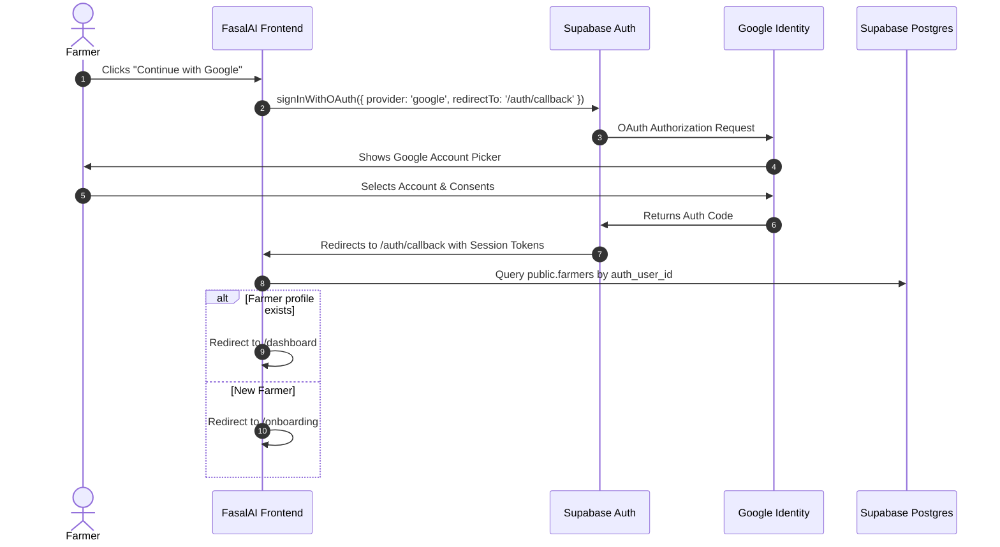

# Google OAuth & Supabase Authentication Setup Guide

This document contains the exact configuration required to enable **Google Sign-In** with Supabase Auth for local development and Vercel production.

---

## 1. Google Cloud Console Configuration

1. Go to the [Google Cloud Console](https://console.cloud.google.com/).
2. Select your project (or create a new project named `FasalAI`).
3. Navigate to **APIs & Services** → **OAuth consent screen**:
   - User Type: **External**
   - App Name: `FasalAI`
   - User support email: Select your email
   - Developer contact email: Enter your email
   - Scopes: Add `.../auth/userinfo.email`, `.../auth/userinfo.profile`, `openid`
4. Navigate to **APIs & Services** → **Credentials**:
   - Click **+ CREATE CREDENTIALS** → **OAuth client ID**
   - Application type: **Web application**
   - Name: `FasalAI Web Client`
   - **Authorized JavaScript origins**:
     - `http://localhost:3000`
     - `http://127.0.0.1:3000`
     - `https://fasal-ai-one.vercel.app`
     - `https://your-project-id.supabase.co`
   - **Authorized redirect URIs**:
     - `https://<YOUR_SUPABASE_PROJECT_REF>.supabase.co/auth/v1/callback`
5. Copy the generated **Client ID** and **Client Secret**.

---

## 2. Supabase Dashboard Configuration

1. Go to the [Supabase Dashboard](https://supabase.com/dashboard).
2. Select your project.
3. Navigate to **Authentication** → **Providers**:
   - Locate **Google** and toggle it **Enabled**.
   - Paste the **Client ID** from Google Cloud Console.
   - Paste the **Client Secret** from Google Cloud Console.
   - Click **Save**.
4. Navigate to **Authentication** → **URL Configuration**:
   - **Site URL**:
     - Local Dev: `http://localhost:3000`
     - Production: `https://fasal-ai-one.vercel.app`
   - **Redirect URLs** (Add all):
     - `http://localhost:3000/**`
     - `http://localhost:3000/auth/callback`
     - `http://127.0.0.1:3000/**`
     - `http://127.0.0.1:3000/auth/callback`
     - `https://fasal-ai-one.vercel.app/**`
     - `https://fasal-ai-one.vercel.app/auth/callback`
     - `https://fasalai.vercel.app/**`

---

## 3. Environment Variables Configuration

### Frontend (`frontend/.env.local` for Local, Vercel Dashboard for Production)
```env
NEXT_PUBLIC_API_URL=http://127.0.0.1:8000/api/v1
NEXT_PUBLIC_SUPABASE_URL=https://<YOUR_SUPABASE_PROJECT_REF>.supabase.co
NEXT_PUBLIC_SUPABASE_PUBLISHABLE_KEY=<YOUR_SUPABASE_ANON_KEY>
```

### Backend (`backend/.env` for Local, Render Dashboard for Production)
```env
SUPABASE_URL=https://<YOUR_SUPABASE_PROJECT_REF>.supabase.co
SUPABASE_KEY=<YOUR_SUPABASE_ANON_KEY>
SUPABASE_SECRET_KEY=<YOUR_SUPABASE_SERVICE_ROLE_KEY>
```

---

## 4. User Journey & OAuth Flow in FasalAI


