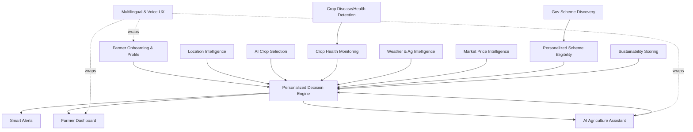
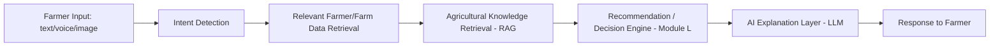
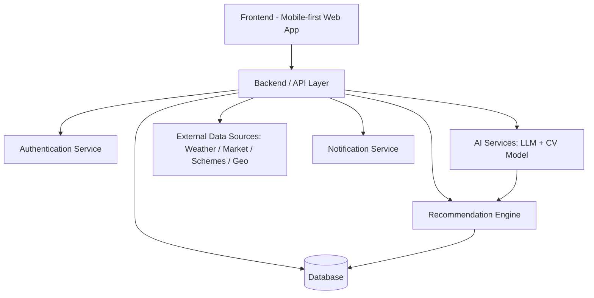

# PRD — PR·FUSION: AI Personalized Agriculture Decision Support Platform
### Team Genzcoderz (NXH036) · NEXORA 2026 Innovation Hackathon · KES B.K. Shroff M.H. Shroff College

**Document status:** Implementation-ready draft v1.0
**Document owner:** Team Genzcoderz
**Audience:** Hackathon judges, dev team, and any AI coding agent implementing this product

**Labeling convention used throughout this document:**
- **[CONFIRMED]** — stated explicitly in the problem statement / hackathon brief
- **[ASSUMPTION]** — a reasonable product assumption made by this team, not verified
- **[PROPOSED]** — a proposed feature/design decision open to change
- **[FUTURE]** — explicitly out of MVP scope
- **[TO VERIFY]** — any API, dataset, statistic, or agricultural/government fact that must be verified before or during build; nothing here should be treated as ground truth without verification

---

## 1. Executive Summary

PR·FUSION is a personalized, explainable, AI-driven agricultural decision-support platform for small and rural farmers. Instead of another information dashboard, it fuses **farmer profile + farm data + location + weather + crop health + market prices + government schemes** into a single decision engine that answers one question at every screen: *"What should I do, and why?"*

The MVP is a mobile-first web app with five core capabilities: (1) farmer/farm onboarding and personalization, (2) AI crop recommendation with suitability scoring, (3) AI crop disease/health detection from photos, (4) weather-driven agricultural guidance, (5) market price comparison and government scheme discovery — all tied together by a conversational AI assistant and a personalized decision engine, with regional-language and voice accessibility as first-class concerns.

Product philosophy: **"We don't give farmers more information. We turn information into decisions."**

---

## 2. Hackathon Context

| Field | Value |
|---|---|
| Team Name | Genzcoderz |
| Team ID | NXH036 |
| College | KES B.K. Shroff M.H. Shroff College |
| Problem Statement Code | PR·FUSION |
| Track | AI Personalized Agriculture Decision Support Platform |

**[CONFIRMED] Official problem description:** "Small and rural farmers often lack timely, reliable information for crop selection, disease detection, market prices, and government schemes. The proposed platform brings these decisions together using AI, location-specific intelligence, crop-health analysis, market information, and government-support discovery to enable smarter and more sustainable farming decisions."

---

## 3. Problem Statement (Restated)

Rural and small farmers make high-stakes seasonal decisions (what to plant, how to treat a sick crop, where to sell, which subsidy to claim) using fragmented, delayed, and often unreliable sources — word of mouth, guesswork, local traders, and scattered government portals. The problem is not a lack of data; it is a lack of **personalized, timely, trustworthy synthesis** of that data into a decision the farmer can act on today.

---

## 4. Problem Analysis

### 4.1 Crop Selection
Farmers often choose crops based on habit, neighbor behavior, or trader suggestion rather than a synthesis of soil type, water availability, season, budget, local climate, and current/expected market conditions. **[ASSUMPTION]** Most small farmers do not have easy access to a single tool that scores crop options against their specific constraints.

### 4.2 Disease Detection
Crop diseases are frequently identified late — after visible, often irreversible damage — because expert agronomists are scarce in rural areas and farmers lack a fast first-line diagnostic tool. **[ASSUMPTION]** A farmer's own visual inspection, without expert input, has meaningfully lower accuracy and speed than an assisted diagnostic flow.

### 4.3 Market Information
Farmers frequently sell at the nearest or most familiar market without visibility into nearby market prices, historical trends, or a comparison of net return after transport cost — leading to preventable revenue loss.

### 4.4 Government Schemes
Central and state schemes are numerous, poorly indexed for individual eligibility, and require documents/processes that are not surfaced proactively to the people who qualify. Farmers frequently miss subsidies, insurance, and support programs simply because they never discover them.

### 4.5 Fragmented Information
Today these five domains (crop advice, disease help, weather, market prices, schemes) live in different apps, offices, or word-of-mouth networks with no shared context about *this specific farmer and this specific farm*. Each source requires the farmer to re-explain their situation.

### 4.6 Digital Accessibility
**[CONFIRMED — problem scope]** Any solution must work for users with limited digital literacy, regional-language preference, low-bandwidth connectivity, and limited time — meaning voice interaction, simple UX, and minimal typing are not "nice to have," they are core requirements.

---

## 5. Product Vision

> Transform **Farmer Profile + Farm Data + Location + Weather + Crop Health + Market Information + Government Schemes** into **personalized, explainable, actionable agricultural decisions.**

PR·FUSION acts as a single, trustworthy decision layer on top of agricultural complexity. It never simply displays raw data; every module exists to answer a decision-oriented question (What should I grow? What's wrong with my crop? Where should I sell? What am I eligible for? What should I do today?).

**Scope guardrail [CONFIRMED — do not violate]:** This is *not* a generic farmer super-app. Equipment rental, labor marketplace, farmer social network, storage marketplace, generic e-commerce, tractor booking, logistics marketplace, generic farm education, and unrelated fintech are explicitly **out of MVP scope** and may only appear as **[FUTURE]** roadmap mentions.

---

## 6. Goals & Objectives

| Objective | Measurable Success Metric (hackathon demo scope) |
|---|---|
| Help farmers make better crop-selection decisions | % of demo sessions where farmer selects a suggested crop after seeing reasoning; suitability score displayed for 100% of recommendations |
| Reduce difficulty of identifying crop-health problems | Time from photo upload to actionable result (target **[PROPOSED]** < 10s); diagnosis includes confidence score 100% of the time |
| Make market information understandable | 100% of price views show a plain-language "where to consider selling" comparison, not just raw numbers |
| Help farmers discover relevant government support | % of onboarded profiles that surface at least one "Likely Eligible" scheme |
| Provide location-aware recommendations | 100% of crop/weather/market/scheme results are filtered by farmer location |
| Convert raw data into actionable recommendations | Every P0 screen contains an explicit "what to do" statement, not only data |
| Improve accessibility via voice/regional language | At least 1 regional language + voice input functional in MVP demo |
| Encourage sustainable decisions | 100% of crop recommendations include a sustainability/risk indicator |

**[ASSUMPTION]** These are hackathon-scope proxy metrics, not validated production KPIs; see Section 20 for the full metrics framework and the separation between demo metrics and future real-world impact metrics.

---

## 7. Target Users & Personas

### 7.1 Primary Persona — "Ramesh": Small/Rural Farmer

| Attribute | Detail |
|---|---|
| Demographics | **[ASSUMPTION]** Age 30–55, owns/leases 0.5–5 acres, rural/semi-rural India |
| Digital literacy | Limited; comfortable with basic smartphone apps (calls, WhatsApp), not with complex forms |
| Device | Entry-to-mid-range Android smartphone, intermittent connectivity |
| Language | Prefers regional/local language over English |
| Time | Very limited time to browse; wants fast, direct answers |
| Financial resources | Limited budget for inputs; risk-averse on unproven advice |
| Goals | Choose the right crop, catch disease early, sell at a fair price, not miss subsidies |
| Pain points | Fragmented sources, late disease detection, missed schemes, distrust of unclear "black box" advice |
| Current behavior | Asks neighbors/local trader, visits nearest market out of habit, occasionally calls a helpline |
| Information sources today | Word of mouth, local trader, occasional government office visit, TV/radio weather |
| Jobs-to-be-done | "Help me decide what to plant," "Tell me what's wrong with my crop and what to do," "Tell me where to sell for the best return," "Tell me what support I can get" |
| How PR·FUSION helps | One app, regional language + voice, explains *why*, and gives a next action, not just data |

### 7.2 Secondary Persona — Progressive / Tech-Enabled Farmer
**[ASSUMPTION]** Younger, more comfortable with apps, larger landholding, interested in data-driven optimization and willing to try new crops/practices. Uses the platform for comparison and trend data more than basic guidance. Values historical price trends and sustainability scoring more heavily than the primary persona.

### 7.3 Secondary Persona — Agricultural Expert / Extension Worker
**[ASSUMPTION]** Government or NGO agricultural officer who may be looped in via the "human expert escalation" path when AI confidence is low (Section 16). Not a core MVP user interface target, but the system must support this escalation conceptually.

### 7.4 Secondary Persona — Administrator / Data Manager
**[ASSUMPTION]** A person (hackathon team / future ops role) responsible for keeping scheme data, market data sources, and crop-knowledge content current. Needs a way to update/verify scheme and knowledge-base content (P1/P2, not farmer-facing).

---

## 8. Jobs-to-be-Done (Summary)

1. When I'm deciding what to plant, help me pick the crop most suited to my land, budget, and season, and tell me why.
2. When my crop looks unhealthy, help me understand what's wrong and what to do, fast.
3. When I'm ready to sell, help me know where I'll get the best return.
4. When I might qualify for government help, tell me before I miss it.
5. When conditions change (weather, price, disease risk), warn me only if it's relevant to me.
6. When I don't know how to use the app, let me just talk to it in my language.

---

## 9. Product Principles

1. **Decisions over data.** Every screen must answer "what should I do?", not just "here is information."
2. **Explainability by default.** Every AI recommendation carries a visible "Why this?" reasoning.
3. **Honesty about uncertainty.** Confidence scores, freshness, and "estimate not guarantee" labels are mandatory wherever AI or projected values are shown.
4. **Accessibility first.** Regional language and voice are core UX, not an add-on.
5. **Stay in scope.** Every feature must trace back to PR·FUSION's five pillars (crop, health, weather, market, schemes) via the decision engine.
6. **Buildable by a small team.** MVP scope must be realistically shippable in hackathon timelines.

---

## 10. Solution Overview

PR·FUSION is structured as **15 modules (A–O)** feeding a single **Personalized Decision Engine (Module L)**, surfaced through a **Farmer Dashboard (Module O)** and a **Conversational AI Assistant (Module J)** that acts as an alternate entry point into every other module.

---

## 11. Feature Architecture — Detailed Module Requirements

### MODULE A — Farmer Onboarding & Profile

**Purpose:** Capture the minimum data needed to personalize every downstream module.

| Field | Required? | Notes |
|---|---|---|
| Phone number / login | Required | **[PROPOSED]** OTP-based login for low-literacy friendliness |
| Preferred language | Required | Drives all UI text + voice (Module K) |
| Location (GPS or manual) | Required | Feeds Module B |
| Farmer name | Required | Personalization only |
| Land size (acres) | Required | Feeds crop/scheme engines |
| Soil type | Optional (recommended) | Dropdown with common types; "Not sure" allowed → triggers fallback logic |
| Irrigation availability | Required | Yes/No/Partial |
| Water source | Optional | Borewell/canal/rain-fed/other |
| Current crop | Optional | If mid-season |
| Previous crop(s) | Optional | Improves crop rotation & sustainability suggestions |
| Farming experience (years) | Optional | Light personalization only |
| Budget for current cycle | Optional (recommended) | Used in crop cost/ROI filtering |
| Risk preference | Optional | Low/Medium/High — affects crop ranking weighting |

**Validation:** Phone format validation; land size must be > 0; GPS fallback to manual district/taluka/village picker if permission denied.
**Data storage:** Farmer + Farm entities (Section 13).
**Personalization effect:** Every optional field left blank degrades recommendation confidence but never blocks the farmer from proceeding — the system must always produce a best-effort recommendation and disclose which inputs were missing (see Module L "fallback behavior").

### MODULE B — Location Intelligence

**Purpose:** Ground every other module in the farmer's real geography.

Captured/derived: GPS coordinates, State, District, Taluka, Village, farm coordinates (optional pin-drop). Location determines: nearby agricultural markets (Module G), local weather (Module F), local crop suitability (Module C), regional crop-health/disease risk (Module D/E), and applicable state-level government schemes (Module H).

**Flow through the recommendation engine:** Location → resolves administrative hierarchy → used as a filter key for weather API calls, market API/dataset lookups, and scheme eligibility rules, and as a contextual signal (regional climate/soil norms) for the crop suitability model.

### MODULE C — AI Crop Selection Engine

**Inputs:** location, soil, season, weather, water availability, land size, budget, previous crop, market conditions, risk preference, sustainability weighting.

**Outputs per recommended crop:**

| Output | Description |
|---|---|
| Suitability score | 0–100%, model/rule-based composite |
| Reasoning | Plain-language "why" (soil + water + season + market) |
| Expected duration | Days/weeks to harvest |
| Water requirement | Qualitative (Low/Med/High) + estimated if data supports |
| Estimated input cost | **Labeled as estimate** |
| Estimated yield | **Labeled as estimate** |
| Estimated revenue | **Labeled as estimate**, derived from yield × current market price |
| Estimated profit | Revenue − cost, **labeled as estimate** |
| Risk level | Low/Medium/High |
| Sustainability score | 0–100, from Module M |

**Crop comparison example:**

| Crop | Suitability | Cost (est.) | Expected Revenue (est.) | Risk |
|---|---:|---:|---:|---|
| Onion | 91% | ₹X | ₹Y | Medium |
| Soybean | 83% | ₹X | ₹Y | Low |
| Tomato | 77% | ₹X | ₹Y | High |

All monetary/yield figures **must** carry an "Estimate — not guaranteed" label in the UI (Rule 8, Section 30 equivalent → Section "Critical Instructions" below).

### MODULE D — AI Crop Disease / Health Detection

**Flow:** Camera capture or image upload → crop identification → disease/pest/nutrient-deficiency detection (where supported) → confidence score → severity → symptoms → possible causes → recommended actions → prevention → monitoring plan.

**Statuses returned:** Healthy / Watch / At Risk / Severe (shared vocabulary with Module E).

**Uncertainty handling [MANDATORY]:** If model confidence is below threshold **[PROPOSED threshold: 60%, TO VERIFY against actual model performance]**, the system must respond:
> "The system is not confident enough to provide a reliable diagnosis. Please upload a clearer image or consult an agricultural expert."
The product must never present AI diagnosis as certain fact — every diagnosis screen shows a confidence score and a "this is not a substitute for expert advice" disclosure.

### MODULE E — Crop Health Monitoring

Tracks: current health status, history of scans, disease timeline, risk indicators, and crop-health alerts (feeds Module N). Health data feeds back into Module L — e.g., a "Severe" status can trigger a scheme lookup (crop insurance) or a market-timing suggestion (sell before further loss) or a delayed weather-based spraying recommendation.

### MODULE F — Weather & Agricultural Intelligence

Not a generic weather app — every weather data point is translated into a farming decision.

| Weather Data | Farming Decision Translated |
|---|---|
| Current conditions, hourly/daily forecast, rain probability, rainfall, temperature, humidity, wind | Irrigation timing, sowing timing, spraying timing, fertilizer timing, harvest timing, extreme-weather prep |

**Example:** "Rain expected tomorrow → Recommend delaying pesticide spraying." Weather alerts (heavy rain, storm, heat wave) feed directly into Module N (Smart Alerts) and Module L (Decision Engine), and are filtered by the farmer's current crop stage where known.

### MODULE G — Market Price Intelligence

Includes current price, nearby market prices, historical prices/trend, min/max/average price, market-to-market comparison, distance to market, estimated transport cost (**where data available**), and estimated net return per market.

**Core question answered:** *"Where should I consider selling?"* — generated by ranking nearby markets on `(price × expected quantity) − estimated transport cost`, all clearly labeled as **estimates**, never guaranteed price predictions.

### MODULE H — Government Scheme Discovery

For every scheme, display: Name, Purpose, Benefits, Eligibility criteria, Required documents, Application process, Deadline, Official source, Application link (where available). Covers central schemes, state-level schemes, subsidies, insurance/support programs, irrigation support, and equipment support **strictly where relevant to agriculture** (not a general subsidy directory).

### MODULE I — Personalized Scheme Eligibility

**Inputs:** location, land size, crop, farmer profile, farm characteristics.

**Output buckets:**
- **Likely Eligible** — with explanation of why
- **More Information Required** — with explanation of what's missing
- **Unlikely Eligible** — with explanation of why

Eligibility is never stated as legally guaranteed unless confirmed against the official source; UI must show "verify on official portal" for every result.

### MODULE J — AI Agriculture Assistant

A conversational interface (text, voice, image, plus implicit location + farmer profile context) that acts as an alternate entry point into every other module. Example: farmer sends a photo with "My tomato leaves have yellow spots. What should I do?" → assistant combines the image, current crop, location, weather, and crop history to produce a contextual, explainable response (routes internally through Module D + Module F + Module L).

### MODULE K — Multilingual & Voice UX

Regional language support, voice input (speech-to-text), text-to-speech output, simple vocabulary, large touch targets, minimal typing, icon-based navigation, low-bandwidth behavior, and offline/cached content where practical. See Section 18 for MVP language scope.

### MODULE L — Personalized Decision Engine

The architectural core. Combines Farmer Profile + Farm Data + Location + Weather + Crop Health + Market Data + Government Schemes → **Personalized Recommendation.**

Examples:
- "Recommended crop: Onion — Reason: soil suitability + water availability + season + local market conditions."
- "Do not spray today because rainfall is expected."
- "Nearby Market B currently offers a better estimated net return."

**Explicit design requirements:**
- **Inputs:** all module outputs above, versioned/timestamped.
- **Decision logic:** a rules layer (hard constraints — e.g., don't recommend a crop needing irrigation to a farmer with none) combined with a scored ranking layer (soft weighting across suitability, cost, risk, sustainability).
- **AI components:** LLM for explanation generation, ML/CV for disease detection, retrieval for scheme/knowledge facts (see Section 14).
- **Confidence:** every recommendation surfaces a confidence indicator derived from completeness of inputs and underlying model/data confidence.
- **Explainability:** every recommendation has a mandatory "Why this?" expansion.
- **Data freshness:** every data-backed number displays a "last updated" timestamp.
- **Fallback behavior:** if a data source is unavailable (e.g., market API down), the engine degrades gracefully — shows cached/last-known data with a "stale data" label, or omits that factor and discloses it was omitted, rather than failing silently or blocking the recommendation.

### MODULE M — Sustainability

Includes water efficiency, fertilizer efficiency, crop rotation suitability, soil-health considerations, reduced unnecessary chemical usage, integrated pest management hints, and sustainable-crop weighting. Produces a **sustainability score (0–100)** feeding Module C's comparison table. **[TO VERIFY]** No unsupported environmental claims (e.g., specific CO2/water savings numbers) are made without a cited methodology.

### MODULE N — Smart Alerts

Categories: Weather (rain/storm/heat/extreme), Crop (disease risk, pest risk, health change), Market (significant price movement), Government (relevant new scheme, deadline reminder). Alerts are filtered to be **relevant only** — i.e., matched against the farmer's location, current crop, and profile before being sent; no blanket broadcast alerts.

### MODULE O — Farmer Dashboard

Single-screen summary answering: **"What do I need to know about my farm right now?"** Contains: farmer/farm summary, today's weather, current crop, crop health status, market snapshot, relevant schemes, important alerts, AI assistant entry point, and top personalized recommendation(s).

---

## 12. User Flows

Format: **Trigger → Steps → System Logic → Result → Edge Cases**

### 12.1 New Farmer Onboarding
- **Trigger:** First app open.
- **Steps:** Splash → language selection → phone/OTP login → location capture (GPS or manual) → basic farmer profile → farm profile → confirmation.
- **System logic:** Creates Farmer + Farm records; resolves location to admin hierarchy; sets default language for all future screens/voice.
- **Result:** Farmer lands on Home Dashboard with a "complete your profile for better recommendations" nudge if optional fields are blank.
- **Edge cases:** GPS denied → manual location picker; no phone network for OTP → **[TO VERIFY]** alternate login method needed.

### 12.2 Setting Up Farm Profile
- **Trigger:** From onboarding or Settings → "My Farm."
- **Steps:** Enter/edit land size, soil type, irrigation, water source, current/previous crop, budget, risk preference.
- **System logic:** Each field updates the Farm entity and invalidates cached crop/scheme recommendations so they regenerate on next view.
- **Result:** Updated Farm profile; recommendation confidence indicator improves as fields are filled.
- **Edge cases:** Farmer unsure of soil type → "Not sure" option triggers use of regional soil defaults **[ASSUMPTION]** with lower confidence flag.

### 12.3 Getting Crop Recommendations
- **Trigger:** Farmer opens "Crop Recommendations" (or asks AI Assistant).
- **Steps:** System reads Farm+Location+Weather+Market → Module C runs → ranked list displayed with suitability score.
- **System logic:** Rules filter out infeasible crops (e.g., no irrigation + high-water crop) → scoring ranks remainder → top 3–5 shown.
- **Result:** Ranked crop list with "Why this?" available per crop.
- **Edge cases:** Missing budget/soil data → recommendations still shown, confidence marked "Moderate" with a prompt to complete profile.

### 12.4 Comparing Recommended Crops
- **Trigger:** Farmer taps "Compare" on 2–3 crops.
- **Steps:** Side-by-side table (suitability, cost, revenue, risk, sustainability).
- **System logic:** Pulls same Module C output objects; no re-computation.
- **Result:** Comparison table with estimate labels.
- **Edge cases:** Only one crop meets hard constraints → comparison view shows single card with explanation of why others were excluded.

### 12.5 Scanning a Crop
- **Trigger:** Farmer taps "Scan" (camera icon).
- **Steps:** Capture/upload image → optional: select current crop from profile → submit.
- **System logic:** Image → Module D pipeline (crop ID → disease/pest detection → confidence scoring).
- **Result:** Navigates to Diagnosis Result screen.
- **Edge cases:** Blurry/dark image → low-confidence message asking for a clearer photo; no crop match found → generic "unknown issue, consult expert" result.

### 12.6 Receiving Disease Diagnosis
- **Trigger:** Continuation of 12.5.
- **Steps:** Display identified crop, disease/pest name (if confident), severity, symptoms matched, possible causes, recommended actions, prevention tips.
- **System logic:** Confidence threshold gate (Module D); if below threshold, uncertainty message shown instead of a definitive diagnosis.
- **Result:** Actionable next steps + option to save to Crop Health history (Module E).
- **Edge cases:** Multiple possible diseases with similar confidence → show top 2 with respective confidence, not a single false-certain answer.

### 12.7 Checking Crop Health
- **Trigger:** Farmer opens "Crop Health" from dashboard.
- **Steps:** View current status badge (Healthy/Watch/At Risk/Severe) → scan history timeline.
- **System logic:** Aggregates Module D scan history + time-decay (older scans weighted less for "current status").
- **Result:** Status + trend + link to re-scan.
- **Edge cases:** No scans yet → empty state prompting first scan.

### 12.8 Checking Market Prices
- **Trigger:** Farmer opens "Market."
- **Steps:** Select crop (defaults to current crop) → view current price, nearby markets, trend.
- **System logic:** Pulls Module G data filtered by location + crop.
- **Result:** Price table + trend indicator (up/down/flat) with data freshness timestamp.
- **Edge cases:** No price data for crop/region → "no market data available for this crop near you" with nearest available alternative shown.

### 12.9 Comparing Nearby Markets
- **Trigger:** Farmer taps "Compare markets."
- **Steps:** List of 2–4 nearby markets with price, distance, estimated transport cost, estimated net return.
- **System logic:** Ranks by estimated net return; ties broken by distance.
- **Result:** Ranked list with "Market B currently offers better estimated net return" style summary.
- **Edge cases:** Transport cost data unavailable → shown as "N/A," ranking falls back to price + distance only, disclosed to user.

### 12.10 Finding Relevant Government Schemes
- **Trigger:** Farmer opens "Schemes" or dashboard nudge.
- **Steps:** System pre-filters by location + farm profile → list of relevant schemes.
- **System logic:** Module H catalog filtered through Module I eligibility rules.
- **Result:** List grouped by Likely Eligible / More Info Required / Unlikely Eligible.
- **Edge cases:** No schemes found for profile → empty state suggesting profile completion or checking back later.

### 12.11 Checking Scheme Eligibility
- **Trigger:** Farmer taps into a specific scheme.
- **Steps:** View eligibility criteria mapped against farmer's own profile field-by-field.
- **System logic:** Rule-based match per criterion; missing profile fields flagged as "needed to confirm."
- **Result:** Eligibility verdict + required documents + application link + "verify on official portal" notice.
- **Edge cases:** Scheme data outdated → freshness/last-verified date shown; conflicting info flagged.

### 12.12 Asking AI a Question (Text)
- **Trigger:** Farmer opens AI Assistant, types a question.
- **Steps:** Intent detection → relevant module(s) invoked → contextual answer with explanation.
- **System logic:** See Section 14 AI pipeline (Intent → Retrieval → Decision Engine → Explanation).
- **Result:** Conversational answer, optionally with an embedded card (e.g., crop comparison table) if relevant.
- **Edge cases:** Ambiguous question → assistant asks one clarifying question rather than guessing.

### 12.13 Asking AI Using Voice
- **Trigger:** Farmer taps mic icon.
- **Steps:** Speech-to-text → same pipeline as 12.12 → text-to-speech response (plus on-screen text).
- **System logic:** Module K wraps Module J.
- **Result:** Spoken + written answer.
- **Edge cases:** Unsupported language/dialect → fallback to nearest supported language with a notice; noisy environment → ask farmer to repeat.

### 12.14 Receiving a Personalized Recommendation
- **Trigger:** Any Module L output surfaced on dashboard or in-context (e.g., after a scan or price check).
- **Steps:** Recommendation card shown with headline action + "Why this?" expandable reasoning.
- **System logic:** As per Module L.
- **Result:** Farmer can accept/dismiss/ask follow-up via AI Assistant.
- **Edge cases:** Conflicting signals (e.g., weather says spray now, crop health says wait) → engine surfaces the conflict explicitly rather than silently picking one.

### 12.15 Receiving a Smart Alert
- **Trigger:** Backend job detects a relevant condition (Module N).
- **Steps:** Push/in-app notification → tap opens relevant module with context pre-loaded.
- **System logic:** Alert relevance filter (location + crop + profile match) before dispatch.
- **Result:** Farmer takes action directly from alert.
- **Edge cases:** Multiple alerts at once → grouped/prioritized, not spammed individually.

---

## 13. Information Architecture

**Primary navigation (max 5 destinations) [PROPOSED]:**

| Nav Item | Contains |
|---|---|
| **Home** | Dashboard (Module O): summary, alerts, top recommendation, weather snapshot |
| **My Farm** | Farm profile, crop health status/history, weather intelligence detail |
| **Scan** | Camera-first entry to disease/health detection (Module D) |
| **Market** | Prices, market comparison, and government schemes (schemes nested here or as a card on Home — **[PROPOSED]** nested under Market as "Market & Support" tab) |
| **AI** | Conversational assistant (text + voice), acts as universal search/help |

Settings (language, notifications, profile edit, logout) lives behind a persistent icon on Home, not as a 6th nav item.

---

## 14. UX Requirements

- **Simplicity:** One primary action per screen; avoid multi-panel enterprise-dashboard layouts.
- **Accessibility:** Every screen has a regional-language string set and a voice-input alternative to typing wherever text input is required.
- **Actionability:** Every data screen ends with an explicit "what to do" statement.
- **Explainability:** Every AI recommendation has a visible, tappable "Why?" element.
- **Trust:** Source, freshness timestamp, and confidence indicator shown wherever data is not 100% certain.
- **Safety:** Uncertain AI output is never phrased as fact (see Module D uncertainty handling).
- **Low bandwidth:** Images compressed before upload; core dashboard data cached for offline viewing of last-known state.
- **Low digital literacy:** Icon + short text labels, minimal free-text fields, large tap targets, stepper-style forms instead of long single forms.

---

## 15. Screen Specifications (MVP)

| # | Screen | Purpose | Primary CTA | Secondary CTA | Empty State | Loading State | Error State |
|---|---|---|---|---|---|---|---|
| 1 | Splash | Brand + load | Auto-advance | — | — | Spinner | Retry on failure |
| 2 | Onboarding | Language + intro | Continue | Skip (if returning) | — | — | — |
| 3 | Farmer Profile | Capture identity | Save & continue | — | — | — | Inline field errors |
| 4 | Farm Setup | Capture farm data | Save & continue | Skip optional fields | — | — | Inline field errors |
| 5 | Home Dashboard | "What do I need to know now" | Tap recommendation | View all alerts | "Complete your profile" prompt | Skeleton cards | "Some data unavailable" banner |
| 6 | Crop Recommendations | Ranked crop list | Compare crops | Ask AI why | "Complete profile for recommendations" | Skeleton list | Fallback/cached message |
| 7 | Crop Comparison | Side-by-side crops | Select crop | Back | — | Skeleton table | — |
| 8 | Crop Scan | Capture/upload image | Scan | Choose from gallery | — | Upload progress | "Upload failed, retry" |
| 9 | Diagnosis Result | Show diagnosis | Save to health history | Ask AI / consult expert | — | Analyzing spinner | Low-confidence message (Module D) |
| 10 | Crop Health | Status + history | Re-scan | View timeline | "No scans yet" | Skeleton | — |
| 11 | Weather Intelligence | Weather → decisions | View 7-day forecast | Set alert | — | Skeleton | "Weather data unavailable, showing last known" |
| 12 | Market | Prices for crop | Compare markets | Change crop | "No data for this crop/region" | Skeleton | Stale-data banner |
| 13 | Market Comparison | Rank markets by net return | Select market | — | — | Skeleton | Partial-data disclosure |
| 14 | Government Schemes | List filtered schemes | View scheme | Filter | "No matching schemes yet" | Skeleton list | — |
| 15 | Scheme Details | Full scheme info | Apply (external link) | Save for later | — | — | "Info outdated, verify on portal" |
| 16 | Eligibility Result | Eligibility verdict | View required docs | Ask AI | — | Skeleton | — |
| 17 | AI Assistant | Conversational hub | Send message | Attach image | Welcome prompt suggestions | Typing indicator | "Couldn't process, try again" |
| 18 | Voice Interaction | Voice-first assistant | Tap to speak | Switch to text | — | Listening indicator | "Didn't catch that, try again" |
| 19 | Alerts | List of alerts | Open related module | Dismiss | "No alerts right now" | Skeleton | — |
| 20 | Settings/Language | Preferences | Save | Logout | — | — | — |

**Mobile behavior:** All screens designed mobile-first, single column, bottom nav bar for the 5 primary destinations.

---

## 16. AI Architecture

AI is deliberately **not** a single black-box chat call. The system separates responsibilities:

- **LLM responsibilities:** conversational interface, explanation generation, summarization, natural-language understanding, personalization phrasing.
- **ML/computer-vision responsibilities:** disease detection, crop identification, crop-health analysis from images.
- **Recommendation engine (deterministic + scored):** crop suitability scoring, decision scoring/ranking, risk analysis, eligibility rule matching.
- **Retrieval/RAG:** trusted agricultural knowledge and scheme facts are retrieved from a curated knowledge base, not generated freely by the LLM.

**Pipeline (mandatory shape):**

This is explicitly **not**: `Farmer → LLM → Answer`. The LLM's job is to *understand intent* and *explain the decision engine's output in plain language* — it does not invent crop suitability numbers, prices, or scheme eligibility on its own.

**Hallucination prevention:**
1. Numeric/factual claims (prices, scheme eligibility, yield estimates) come only from the Recommendation Engine or retrieved knowledge base — never generated freely by the LLM.
2. The LLM's explanation layer is constrained (via prompt/response schema) to reference only the structured data it was given.
3. Every factual claim in the AI's answer is traceable to a specific module output; the assistant does not answer scheme/eligibility/price questions without invoking the relevant module first.
4. Confidence scores from Module D/C are passed through to the LLM and must be verbalized, not hidden.
5. **[TO VERIFY]** Specific hallucination-rate benchmarks depend on chosen model/provider and must be validated during build.

---

## 17. Data Architecture

| Entity | Key Fields | Relationships |
|---|---|---|
| **User** | id, phone, auth info, role (farmer/admin) | 1:1 with Farmer (for farmer role) |
| **Farmer** | id, name, language, experience_years, risk_preference | 1:N Farm |
| **Farm** | id, farmer_id, land_size, soil_type, irrigation, water_source, budget | 1:N CropCycle, 1:1 Location |
| **Location** | id, farm_id, lat, lng, state, district, taluka, village | 1:N (used by Weather, Market, Scheme lookups) |
| **Soil** | id, type, characteristics | Referenced by Farm, Crop suitability rules |
| **Crop** | id, name, water_need, season, typical_duration | 1:N CropCycle, 1:N Recommendation |
| **CropCycle** | id, farm_id, crop_id, start_date, status | 1:N CropScan |
| **CropScan** | id, cropcycle_id, image_url, timestamp, result_id | N:1 Disease (nullable) |
| **Disease** | id, name, symptoms, causes, recommended_actions | Referenced by CropScan results |
| **Weather** | id, location_id, timestamp, temp, rain_prob, wind, alerts | Feeds Recommendation |
| **Market** | id, name, location, distance_calc_ref | 1:N MarketPrice |
| **MarketPrice** | id, market_id, crop_id, price, date | Feeds Recommendation |
| **GovernmentScheme** | id, name, level (central/state), purpose, benefits, deadline, source_url | 1:N EligibilityRule |
| **EligibilityRule** | id, scheme_id, criterion, comparator, value | Evaluated against Farmer/Farm |
| **Recommendation** | id, farmer_id, type (crop/spray/market/scheme), payload, confidence, generated_at | Logged for history/metrics |
| **Alert** | id, farmer_id, type, message, relevance_reason, sent_at, read_at | N:1 Farmer |
| **Conversation** | id, farmer_id, messages[], created_at | 1:N linked Recommendations |
| **Notification** | id, farmer_id, channel, payload, status | N:1 Farmer |

---

## 18. External Data Sources

| Domain | Candidate Source | Type | Status |
|---|---|---|---|
| Weather | Government meteorological API / open weather API | Live API | **[TO VERIFY]** exact provider and rate limits |
| Agricultural crop/disease knowledge | Government agri-extension resources, published agronomy datasets | Public dataset / static dataset | **[TO VERIFY]** specific dataset |
| Market prices | Government agricultural market price portal (mandi price data) | Public dataset / Live API | **[TO VERIFY]** exact endpoint/coverage |
| Government schemes | Central/state government scheme portals | Static dataset (manually curated for MVP) | **[TO VERIFY]**; hackathon MVP likely uses a curated demo dataset |
| Soil | Government soil health data where available | Public dataset | **[TO VERIFY]**; MVP likely uses regional defaults |
| Geographic information | Open geocoding/administrative boundary data | Public dataset / Live API | **[TO VERIFY]** provider |

**MVP data strategy [PROPOSED]:** Given hackathon time constraints, weather can realistically use a live API; market prices and schemes will likely rely on a **curated demo/mock dataset** representing real structure, explicitly labeled as demo data in the product, with a documented path to swap in live/official sources post-hackathon. No specific API name is asserted here without verification — mark any API integrated during build as **[TO VERIFY]** until confirmed live and tested.

---

## 19. System Architecture

**Flow notes:**
- **Data flow:** Farmer actions → API → relevant module service → DB read/write → response to Frontend.
- **API flow:** REST/JSON (or GraphQL, **[PROPOSED]**, TBD by dev team) between Frontend and Backend; external source calls proxied server-side (never directly from client) to protect API keys and enable caching.
- **AI inference flow:** Image → CV model service → structured result → Recommendation Engine → LLM explanation layer → Frontend. Text/voice → STT (if voice) → Intent detection → same downstream pipeline.
- **Image-processing flow:** Client-side compression → upload → CV inference → result cached against CropScan record.
- **Market-data flow:** Scheduled/periodic fetch from market data source → normalized into MarketPrice table → served with freshness timestamp; on-demand refresh falls back to cached data if source is unavailable.
- **Scheme-data flow:** Curated/periodically updated GovernmentScheme + EligibilityRule tables → evaluated per-farmer at request time (not pre-computed, since farmer profile can change).
- **Weather-data flow:** Location-keyed calls to weather API, cached per location for a short TTL **[PROPOSED: 30–60 min]** to reduce API load and support low-bandwidth conditions.

---

## 20. Security & Privacy

- **Authentication:** OTP/phone-based login **[PROPOSED]**; session tokens with reasonable expiry.
- **Authorization:** Farmer can only access their own Farmer/Farm/Recommendation/Conversation records; admin role scoped separately for scheme/knowledge-base management.
- **Farmer data protection:** Personal data (phone, name, location) stored encrypted at rest; minimal data collection principle — only fields that feed a real feature are collected.
- **Location privacy:** Farm coordinates never exposed publicly; used only server-side for module lookups.
- **Secure image storage:** Crop scan images stored in access-controlled storage, not publicly listable.
- **API security:** All external API keys held server-side only; client never calls third-party APIs directly.
- **Data encryption:** TLS in transit; encryption at rest for sensitive fields **[PROPOSED]**.
- **Input validation:** All form and AI-assistant free-text/image inputs validated/sanitized server-side.
- **Rate limiting:** Applied to AI assistant and scan endpoints to control cost and abuse.
- **Sensitive data handling:** No sharing of individual farmer data with third parties without consent; aggregate/anonymized data only for any future analytics.

---

## 21. AI Safety & Trust

- **Confidence scores:** Displayed on every AI-derived output (disease diagnosis, crop suitability, eligibility).
- **Source attribution:** Scheme and knowledge-base facts show their official source.
- **Data freshness:** Every data-backed number/card shows a "last updated" timestamp.
- **Uncertainty messaging:** Standardized low-confidence message pattern (see Module D) reused across all modules where applicable.
- **Human expert escalation:** Low-confidence disease diagnoses and "Unlikely/More Info Required" scheme results explicitly suggest consulting a human expert or the official portal.
- **Dangerous recommendation prevention:** Hard constraints in the Recommendation Engine prevent, e.g., recommending water-intensive crops with no irrigation, or omitting a "consult expert" flag on severe crop-health statuses.
- **Verified agricultural guidance:** Knowledge-base content sourced from credible/official agricultural sources (Section 18), not freely generated.
- **No guaranteed yield/profit claims:** All such figures labeled "Estimate — not guaranteed" everywhere they appear.
- **No guaranteed disease diagnosis:** Confidence score + "not a substitute for expert advice" shown on every diagnosis.
- **No guaranteed scheme eligibility:** "Likely Eligible" always paired with "verify on official source" language.

---

## 22. Non-Functional Requirements

| Category | Proposed Target | Note |
|---|---|---|
| Performance | Dashboard load < 3s on 3G-equivalent connection | **[PROPOSED]** |
| Availability | Best-effort for hackathon demo; graceful degradation if external APIs fail | **[PROPOSED]** |
| Scalability | Architecture should not block scaling beyond hackathon demo (stateless API layer) | **[PROPOSED]** |
| Accessibility | At least 1 regional language + voice functional in MVP | **[PROPOSED]**, see Section 23 |
| Localization | UI strings externalized for easy addition of further languages | **[PROPOSED]** |
| Low bandwidth | Images compressed client-side before upload; core screens cache last-known data | **[PROPOSED]** |
| Mobile responsiveness | Fully responsive, mobile-first; no desktop-only flows | **[CONFIRMED — accessibility requirement]** |
| Security | See Section 20 | — |
| Reliability | Fallback/cache behavior on every external-data-dependent module (Section 11, Module L) | **[CONFIRMED — design rule]** |
| AI response time | Text/voice assistant response < 5–8s **[PROPOSED]**; image diagnosis < 10s **[PROPOSED]** |  |

---

## 23. MVP Scope (P0 / P1 / P2)

### P0 — MUST HAVE (hackathon MVP)
Farmer profile, location intelligence, crop recommendation, crop suitability scoring, disease detection, crop-health analysis, weather intelligence, market prices, market comparison, government schemes, scheme eligibility, AI assistant (text minimum), personalized recommendations (Module L), sustainability/risk scoring, smart alerts, farmer dashboard.
**Why P0:** These map 1:1 to the five pillars explicitly named in the PR·FUSION problem statement (crop selection, disease detection, market prices, government schemes, plus the location/personalization layer that ties them together). Without all of these, the product cannot demonstrate the core "decision, not information" thesis.

### P1 — IF TIME ALLOWS
Voice assistant (full speech-to-text/text-to-speech), additional regional languages beyond the MVP language, historical price trend analysis, advanced crop-health history/timeline views, satellite monitoring, advanced analytics dashboards.
**Why P1:** These meaningfully improve accessibility and depth but are not required to prove the core decision-engine concept; voice specifically is high-value but higher-risk to implement reliably within hackathon time, so text-first AI assistant is P0 and voice layered on top is P1.

### P2 — FUTURE
Expert marketplace, equipment rental, labor marketplace, storage marketplace, community/social features, IoT integration, automated irrigation, advanced satellite intelligence.
**Why P2:** Explicitly out of scope per the "What Not to Build" guardrail (Section 27) — these are generic farmer-super-app features that dilute focus away from the assigned decision-support problem statement, and are only mentioned as future roadmap possibilities.

---

## 24. Hackathon Demo Flow (5–8 minutes)

**Demo persona:** Ramesh Patil · Nashik, Maharashtra · 2 acres · Black soil · Moderate water · Budget ₹50,000 *(fictional, for demo only)*

| Step | What Happens | What the Judge Should See |
|---|---|---|
| 1. Onboarding | Ramesh selects Marathi, logs in, sets location | Fast, simple, regional-language-first UX |
| 2. Location selection | GPS auto-fills Nashik, district/taluka confirmed | Location flows into every later screen automatically |
| 3. AI crop recommendation | System generates ranked crop list | Suitability score + plain-language "why" for top crop (Onion) |
| 4. Crop comparison | Onion vs Soybean vs Tomato table | Clear cost/revenue/risk comparison, all labeled "estimate" |
| 5. Disease image scan | Ramesh photographs a diseased leaf | Confidence score, severity, recommended action shown within seconds |
| 6. Weather decision | Dashboard shows "rain expected tomorrow" | Explicit "delay spraying" recommendation tied to the forecast |
| 7. Market comparison | Ramesh checks where to sell onions | Two nearby markets compared by estimated net return, not just price |
| 8. Government scheme matching | Scheme list appears, filtered to his profile | "Likely Eligible" scheme shown with required documents and official link |
| 9. Ask AI (text/voice) | Ramesh asks "What should I do today?" | Assistant answers using the actual profile + weather + crop-health context, not generic text |
| 10. Final personalized recommendation | Dashboard synthesizes everything into one action | A single, explained, prioritized recommendation for today |

**Closing line for the demo:** *"We don't give farmers more information. We turn information into decisions."*

---

## 25. Success Metrics

### Product (demo-scope)
- Onboarding completion rate
- Recommendation completion rate (farmer views a full crop recommendation, not just a partial load)
- AI assistant usage (queries per session)
- Crop scan completion rate

### Decision Quality
- Recommendation confidence (avg. displayed confidence score)
- User acceptance of recommendations (demo proxy: taps "why"/accepts suggested crop or market)
- Correct disease classification rate — **[TO VERIFY]** requires a labeled test image set; not claimed without evaluation

### Engagement
- Daily active users **[FUTURE — post-hackathon metric]**
- Returning farmers **[FUTURE]**
- Alert interaction rate **[FUTURE]**

### Impact (clearly separated from hackathon demo metrics)
- **[FUTURE / not measurable at hackathon stage]** Potential cost savings, potential improved market return, scheme discovery rate at scale, reduction in time needed to find information.
- **[CONFIRMED RULE]** No real-world impact numbers are invented for this document; any such figures must come from actual pilot data collected post-hackathon.

---

## 26. Edge Cases

| Edge Case | Expected System Behavior |
|---|---|
| No internet | Show last cached dashboard state with a clear "offline / last updated at X" banner; disable actions that require live data |
| Poor-quality crop image | Module D returns low-confidence uncertainty message, asks for a clearer photo |
| Unknown disease (not in knowledge base) | Return "unrecognized issue" with symptoms noted and a recommendation to consult an expert, rather than forcing a guess |
| No market data for crop/region | Show explicit "no data available" state; do not fabricate a price |
| Outdated market/scheme data | Show freshness timestamp and a "may be outdated, verify" notice |
| Missing soil information | Use regional default with a lowered confidence indicator on crop recommendations |
| Missing location | Block location-dependent modules with a clear prompt to set location; core app (e.g., generic knowledge via AI assistant) can still respond |
| No government scheme match | Empty state explaining why (e.g., "no state schemes indexed yet for your district") rather than a blank screen |
| Conflicting data sources | Decision Engine surfaces the conflict explicitly (Section 11, Module L) instead of silently resolving it |
| Weather API failure | Fall back to last cached forecast with a "may be stale" label; suppress weather-dependent recommendations that require live data, or label them as based on stale data |
| AI uncertainty (general) | Standardized uncertainty message + suggested next step (retry, provide more info, consult expert) |
| Unsupported language | Fallback to nearest supported language with a visible notice, never silently mistranslate |
| Farmer enters incorrect data (e.g., unrealistic land size) | Inline validation with a sanity-check range; allow override with a warning, don't hard-block unless clearly invalid (e.g., negative numbers) |
| Multiple farms | Farmer entity supports 1:N Farm relationship (Section 17); UI provides a farm switcher **[P1 if not P0]** |
| Multiple crops | Farm supports multiple concurrent CropCycle records; dashboard shows per-crop status |
| New/unseen crop (not in Crop table) | Recommendation Engine flags as "insufficient data for this crop" rather than guessing suitability |

---

## 27. Acceptance Criteria (per P0 feature)

### Farmer Onboarding & Profile
**Given** a new farmer opens the app, **When** they complete onboarding, **Then** the system: 1) creates Farmer + Farm records, 2) sets language preference for all future UI/voice, 3) stores location, 4) allows optional fields to be skipped, 5) shows a profile-completeness indicator, 6) never blocks access to core features due to incomplete optional fields.

### Location Intelligence
**Given** a farmer sets a location, **When** any location-dependent module loads, **Then** it: 1) uses that farm's stored location automatically, 2) resolves state/district/taluka, 3) filters weather/market/scheme results accordingly, 4) allows the farmer to correct location if GPS was inaccurate.

### Crop Recommendation
**Given** location, soil, water, season, budget, **When** the farmer requests crop recommendations, **Then** the system: 1) generates ranked crops, 2) displays suitability score, 3) explains the reasoning, 4) displays estimated cost/yield/revenue where data exists, 5) displays risk, 6) displays sustainability, 7) clearly labels all estimates, 8) allows comparison.

### Disease Detection
**Given** a farmer submits a crop image, **When** the system processes it, **Then** it: 1) returns crop identification where possible, 2) returns disease/pest detection where confidence allows, 3) always shows a confidence score, 4) shows the standardized uncertainty message when confidence is below threshold, 5) provides recommended actions and prevention tips when a diagnosis is given, 6) never presents a diagnosis as guaranteed fact.

### Crop Health Monitoring
**Given** a farmer has one or more prior scans, **When** they open Crop Health, **Then** the system: 1) shows current status (Healthy/Watch/At Risk/Severe), 2) shows scan history timeline, 3) reflects new scans immediately in current status, 4) surfaces a health-based alert when status worsens.

### Weather & Agricultural Intelligence
**Given** a farmer's location and current crop, **When** they view Weather, **Then** the system: 1) shows current + forecast conditions, 2) translates at least one condition into an explicit farming-decision recommendation (e.g., delay spraying), 3) shows data freshness, 4) falls back to cached data with a stale-data notice if the live source fails.

### Market Price Intelligence
**Given** a farmer's location and selected crop, **When** they view Market, **Then** the system: 1) shows current price with freshness timestamp, 2) shows at least one nearby market for comparison where data exists, 3) computes and clearly labels estimated net return, 4) never claims a guaranteed future price.

### Government Scheme Discovery & Eligibility
**Given** a farmer's profile and location, **When** they view Schemes, **Then** the system: 1) lists relevant schemes filtered by location, 2) shows name/purpose/benefits/eligibility/documents/process/deadline/source for each, 3) classifies each as Likely Eligible / More Info Required / Unlikely Eligible with a stated reason, 4) always includes a "verify on official source" notice, 5) never states eligibility as legally guaranteed.

### AI Agriculture Assistant
**Given** a farmer sends a text (and optionally image) query, **When** the assistant responds, **Then** it: 1) detects intent, 2) invokes the relevant module(s) rather than answering from free generation for factual claims, 3) explains its answer, 4) asks a clarifying question when the query is ambiguous rather than guessing, 5) degrades gracefully with an error message if a module call fails.

### Personalized Recommendations (Decision Engine)
**Given** at least Farmer + Farm + Location data, **When** the dashboard loads, **Then** the system: 1) produces at least one top-line recommendation, 2) shows a "Why this?" explanation, 3) shows a confidence indicator, 4) discloses which inputs were missing/stale if any, 5) surfaces conflicting signals explicitly rather than silently resolving them.

### Sustainability / Risk Scoring
**Given** a crop recommendation is generated, **When** displayed, **Then** it: 1) includes a sustainability score, 2) includes a risk level, 3) does not make unsupported environmental claims.

### Smart Alerts
**Given** a relevant condition is detected (weather/crop/market/scheme), **When** the alert engine runs, **Then** it: 1) filters by the farmer's actual location/crop/profile before sending, 2) never sends an irrelevant blanket alert, 3) links directly to the relevant module/context on tap.

### Farmer Dashboard
**Given** a farmer with a complete or partial profile, **When** they open Home, **Then** it: 1) shows farm summary, weather snapshot, current crop, crop health, market snapshot, relevant schemes, alerts, AI entry point, and top recommendation, 2) degrades gracefully (skeleton/empty states) for any section missing data, 3) answers "what do I need to know right now" within a single scroll on mobile.

---

## 28. Product Requirements Table

| ID | Module | Feature | Priority | User Story Ref | Functional Requirement | AI/Data Dependency | Acceptance Criteria Ref |
|---|---|---|---|---|---|---|---|
| FR-001 | A | Language & location onboarding | P0 | US-01 | Capture language + location on first launch | None (device GPS/manual input) | Section 27 — Onboarding |
| FR-002 | A | Farmer profile capture | P0 | US-02 | Capture name, experience, risk preference | None | Section 27 — Onboarding |
| FR-003 | A | Farm profile capture | P0 | US-03 | Capture land size, soil, irrigation, water, budget, current/prev crop | None | Section 27 — Onboarding |
| FR-004 | A | Profile completeness indicator | P0 | US-04 | Show % complete and nudge to fill optional fields | None | Section 27 — Onboarding |
| FR-005 | B | GPS location capture | P0 | US-05 | Auto-detect farm location via GPS with manual fallback | Geo API/dataset | Section 27 — Location |
| FR-006 | B | Location resolves admin hierarchy | P0 | US-06 | Resolve state/district/taluka/village from coordinates | Geo dataset/API | Section 27 — Location |
| FR-007 | C | AI crop recommendation | P0 | US-07 | Generate ranked crop list from farm+location+weather+market | Recommendation Engine + Weather/Market data | Section 27 — Crop Recommendation |
| FR-008 | C | Suitability scoring | P0 | US-08 | Score each crop 0–100% with reasoning | Recommendation Engine | Section 27 — Crop Recommendation |
| FR-009 | C | Cost/yield/revenue/profit estimates | P0 | US-09 | Display labeled estimates per crop | Recommendation Engine | Section 27 — Crop Recommendation |
| FR-010 | C | Crop comparison view | P0 | US-10 | Side-by-side comparison of 2–3 crops | Recommendation Engine | Section 27 — Crop Recommendation |
| FR-011 | D | Crop image capture/upload | P0 | US-11 | Capture or upload a crop image for diagnosis | Client camera/upload | Section 27 — Disease Detection |
| FR-012 | D | Disease/pest detection | P0 | US-12 | Return crop ID + disease/pest + confidence score | CV Model | Section 27 — Disease Detection |
| FR-013 | D | Low-confidence uncertainty handling | P0 | US-13 | Show standardized uncertainty message below threshold | CV Model confidence output | Section 27 — Disease Detection |
| FR-014 | E | Crop health status & history | P0 | US-14 | Show current status + scan timeline | Derived from CropScan records | Section 27 — Crop Health |
| FR-015 | F | Weather forecast display | P0 | US-15 | Show current + forecast weather for farm location | Weather API | Section 27 — Weather |
| FR-016 | F | Weather-based decision recommendation | P0 | US-16 | Translate at least one weather condition into a farming action | Weather API + Recommendation Engine | Section 27 — Weather |
| FR-017 | G | Market price display | P0 | US-17 | Show current price for selected crop near farmer | Market dataset/API | Section 27 — Market |
| FR-018 | G | Nearby market comparison | P0 | US-18 | Rank nearby markets by estimated net return | Market dataset/API + Recommendation Engine | Section 27 — Market |
| FR-019 | H | Government scheme listing | P0 | US-19 | List schemes relevant to farmer's state/district | Scheme dataset | Section 27 — Schemes |
| FR-020 | H | Scheme detail view | P0 | US-20 | Show purpose/benefits/eligibility/documents/deadline/source | Scheme dataset | Section 27 — Schemes |
| FR-021 | I | Eligibility classification | P0 | US-21 | Classify scheme as Likely/More Info/Unlikely per farmer profile | Eligibility rules engine | Section 27 — Schemes |
| FR-022 | J | AI assistant text query | P0 | US-22 | Answer farmer text questions using module pipeline | LLM + Intent detection + Modules | Section 27 — AI Assistant |
| FR-023 | J | AI assistant image query | P0 | US-23 | Accept image within a conversation for diagnosis-style questions | LLM + CV Model | Section 27 — AI Assistant |
| FR-024 | K | Regional language UI | P0 | US-24 | Render UI strings in farmer's selected language | Localization strings | Section 22 |
| FR-025 | K | Voice input (P1 stretch into P0 demo if feasible) | P1 | US-25 | Convert speech to text for assistant queries | STT service | Section 27 — AI Assistant |
| FR-026 | L | Personalized dashboard recommendation | P0 | US-26 | Generate a top-line "what to do today" recommendation | Recommendation Engine (all modules) | Section 27 — Decision Engine |
| FR-027 | L | Recommendation explainability | P0 | US-27 | Every recommendation has a "Why?" expansion | Recommendation Engine + LLM explanation layer | Section 27 — Decision Engine |
| FR-028 | M | Sustainability scoring | P0 | US-28 | Attach sustainability score to each crop recommendation | Recommendation Engine | Section 27 — Sustainability |
| FR-029 | N | Smart alert generation | P0 | US-29 | Generate relevance-filtered alerts across weather/crop/market/scheme | Recommendation Engine + Alert rules | Section 27 — Alerts |
| FR-030 | O | Farmer dashboard aggregation | P0 | US-30 | Aggregate all module summaries into one Home screen | All modules | Section 27 — Dashboard |
| FR-031 | K | Text-to-speech output | P1 | US-31 | Read assistant responses aloud | TTS service | Section 27 — AI Assistant |
| FR-032 | G | Historical price trend | P1 | US-32 | Show price trend over time for a crop | Market dataset (time series) | Section 27 — Market |
| FR-033 | E | Disease timeline / risk indicators | P1 | US-33 | Show longer-term crop health trend | CropScan history | Section 27 — Crop Health |

---

## 29. User Stories

**EPIC-01 Farmer & Farm**
- **US-01 [P0]** As a new farmer, I want to select my language on first launch, so that the app is usable in my own language.
- **US-02 [P0]** As a farmer, I want to create a basic profile, so that recommendations reflect my experience and risk preference.
- **US-03 [P0]** As a farmer, I want to record my farm's land size, soil, irrigation, water source, and budget, so that crop recommendations fit my real constraints.
- **US-04 [P0]** As a farmer, I want to see how complete my profile is, so that I know how to get better recommendations.
- **US-34 [P1]** As a farmer, I want to manage multiple farms/crop cycles, so that I can use the app even if I farm more than one plot.

**EPIC-02 Location Intelligence**
- **US-05 [P0]** As a farmer, I want my location auto-detected, so that I don't have to type it manually.
- **US-06 [P0]** As a farmer, I want to correct my location if GPS is wrong, so that recommendations stay accurate.

**EPIC-03 Crop Intelligence**
- **US-07 [P0]** As a farmer, I want a ranked list of suitable crops, so that I can decide what to plant with confidence.
- **US-08 [P0]** As a farmer, I want to see why a crop is recommended, so that I trust the suggestion.
- **US-09 [P0]** As a farmer, I want estimated cost, revenue, and profit per crop, so that I can plan my budget, understanding these are estimates.
- **US-10 [P0]** As a farmer, I want to compare 2–3 crops side by side, so that I can weigh trade-offs myself.
- **US-35 [P1]** As a progressive farmer, I want to see sustainability scores across crops, so that I can optimize beyond just profit.

**EPIC-04 Crop Health**
- **US-11 [P0]** As a farmer, I want to photograph my crop, so that I can quickly check for disease.
- **US-12 [P0]** As a farmer, I want a diagnosis with confidence and recommended action, so that I know what to do next.
- **US-13 [P0]** As a farmer, I want to be told when the system isn't sure, so that I don't act on a false diagnosis.
- **US-14 [P0]** As a farmer, I want to see my crop's health history, so that I can track whether it's improving or worsening.
- **US-33 [P1]** As a farmer, I want to see a disease/risk timeline, so that I can spot recurring problems.

**EPIC-05 Weather Intelligence**
- **US-15 [P0]** As a farmer, I want to see the weather forecast for my exact farm location, so that it's relevant to me.
- **US-16 [P0]** As a farmer, I want the app to tell me what to do because of the weather (e.g., delay spraying), so that I don't waste inputs or effort.

**EPIC-06 Market Intelligence**
- **US-17 [P0]** As a farmer, I want to see current prices for my crop near me, so that I know what to expect when selling.
- **US-18 [P0]** As a farmer, I want to compare nearby markets by estimated net return, so that I sell where I actually get more money.
- **US-32 [P1]** As a progressive farmer, I want historical price trends, so that I can time my sale better.

**EPIC-07 Government Schemes**
- **US-19 [P0]** As a farmer, I want to see government schemes relevant to my state and district, so that I don't have to search manually.
- **US-20 [P0]** As a farmer, I want full details (documents, deadline, official link) for a scheme, so that I can actually apply.
- **US-21 [P0]** As a farmer, I want to know if I'm likely eligible for a scheme, so that I don't waste time on ones I don't qualify for.

**EPIC-08 AI Assistant**
- **US-22 [P0]** As a farmer, I want to ask a question in plain language, so that I don't need to navigate menus.
- **US-23 [P0]** As a farmer, I want to send a photo with my question, so that I can get help with a specific crop problem.
- **US-25 [P1]** As a farmer with limited literacy, I want to speak my question instead of typing, so that the app is usable for me.
- **US-31 [P1]** As a farmer, I want to hear the answer spoken aloud, so that I don't have to read.

**EPIC-09 Decision Engine**
- **US-26 [P0]** As a farmer, I want one clear "what should I do today" recommendation, so that I don't have to piece it together myself.
- **US-27 [P0]** As a farmer, I want to see why the app is recommending something, so that I can trust and verify it.
- **US-36 [P0]** As a farmer, I want to know when the app's information might be outdated, so that I can decide whether to double check.

**EPIC-10 Sustainability**
- **US-28 [P0]** As a farmer, I want to see a sustainability score for a crop choice, so that I can farm more responsibly without guessing.

**EPIC-11 Alerts**
- **US-29 [P0]** As a farmer, I want to be alerted only when something actually affects me (weather, my crop, price, a scheme), so that I'm not overwhelmed with noise.

**EPIC-12 Accessibility**
- **US-24 [P0]** As a farmer with limited digital literacy, I want a simple, icon-driven interface, so that I can use the app without confusion.
- **US-30 [P0]** As a farmer, I want one home screen that tells me everything important about my farm right now, so that I don't have to hunt across the app.

*(36 user stories provided, exceeding the required minimum of 30; IDs are non-sequential by design where later stories were grouped under their most relevant epic rather than renumbered.)*

---

## 30. Epics (Summary)

| Epic | Focus | Key Modules |
|---|---|---|
| EPIC-01 Farmer & Farm | Identity + farm data capture | A |
| EPIC-02 Location Intelligence | Geographic grounding | B |
| EPIC-03 Crop Intelligence | Crop selection & comparison | C |
| EPIC-04 Crop Health | Disease detection & monitoring | D, E |
| EPIC-05 Weather Intelligence | Weather-to-decision translation | F |
| EPIC-06 Market Intelligence | Price & market comparison | G |
| EPIC-07 Government Schemes | Discovery & eligibility | H, I |
| EPIC-08 AI Assistant | Conversational access layer | J |
| EPIC-09 Decision Engine | Cross-module synthesis | L |
| EPIC-10 Sustainability | Environmental scoring | M |
| EPIC-11 Alerts | Relevance-filtered notifications | N |
| EPIC-12 Accessibility | Language, voice, dashboard UX | K, O |

---

## 31. Risks & Mitigations

| Risk | Impact | Mitigation |
|---|---|---|
| No verified live API for market prices/schemes within hackathon time | Demo may rely on mock data | Use clearly labeled curated demo dataset; document real-source integration path (Section 18) |
| CV disease-detection model accuracy unverified | Wrong/overconfident diagnoses | Mandatory confidence threshold + uncertainty messaging (Module D); use a pretrained/fine-tuned model with a small validated test set before demo |
| LLM hallucination on factual claims (prices, eligibility) | Loss of farmer trust; misinformation | Strict pipeline separation (Section 16): LLM explains, never invents numbers |
| Scope creep toward "super app" features | Dilutes core problem-statement alignment, risks judge penalty for going off-brief | Section 27/32 hard "what not to build" list; every feature must map to Section 28 FR table |
| Low-connectivity demo environment | Live API calls fail during judging | Cache last-known data; design explicit offline/stale-data UI states (Section 22, 26) |
| Small team, limited build time | Cannot complete full P0 list | Strict P0/P1/P2 triage (Section 23); voice and multi-language beyond MVP language are P1, not blocking |
| Language/voice accuracy for regional dialects | Assistant misunderstands farmer | Start with one well-supported MVP language **[PROPOSED]**, fallback messaging for unsupported input |

---

## 32. What Not to Build (MVP Exclusions)

Explicitly out of scope for MVP, regardless of how tempting or "complete" they might make the app feel:

- Generic social network / farmer community feed
- Generic e-commerce or general marketplace
- Tractor or equipment rental marketplace
- Labor marketplace
- Logistics/transport marketplace
- Generic farming education platform unrelated to decision support
- Unrelated financial services (loans, generic fintech)
- Complex IoT hardware integration
- Overly complex satellite analytics
- Any feature that does not directly help the farmer make a crop, health, weather, market, or scheme decision

These may be mentioned only as **[FUTURE]** roadmap items (Section 33), never built as part of the hackathon MVP.

---

## 33. Future Roadmap [FUTURE — explicitly not MVP]

- Full voice-first experience across all modules and multiple regional languages/dialects
- Satellite-based crop monitoring and yield estimation
- IoT sensor integration (soil moisture, automated irrigation triggers)
- Expert marketplace for paid/verified agronomist consultations
- Community knowledge-sharing (separate, carefully scoped from generic social features)
- Deeper financial planning tools tied directly to crop cycles (not generic fintech)
- Expanded scheme coverage with automated application pre-fill where legally permissible
- Historical yield/outcome tracking to improve Recommendation Engine accuracy over time (feedback loop)

---

## 34. Final Product Summary

PR·FUSION takes the five fragmented decision domains named in the PR·FUSION problem statement — crop selection, disease detection, market prices, government schemes, and the location/weather context that ties them together — and unifies them behind one Personalized Decision Engine (Module L) and one accessible interface (dashboard + conversational assistant), built specifically for small and rural farmers with limited digital literacy, regional-language needs, and limited time.

Every module is scoped to answer a decision, not just display data; every AI output is explainable, confidence-scored, and honest about its own uncertainty; every estimate is labeled as an estimate; and every feature in this document traces back to the assigned problem statement (Section 28, FR table) rather than expanding into unrelated "super app" territory (Section 32).

**Internal consistency check:**
Problem Statement (Section 3) → User Problems (Section 4) → Product Goals (Section 6) → Features/Modules (Section 11) → AI Architecture (Section 16) → Data Architecture (Section 17) → User Flows (Section 12) → MVP (Section 23) → Acceptance Criteria (Section 27) — each layer traces cleanly to the one before it, with no P0 feature introduced that is not grounded in the original PR·FUSION brief.

**This document is intended to be handed directly to a development team or an AI coding agent as a build specification.** Any field marked **[TO VERIFY]** must be confirmed (API selection, exact dataset, or specific numeric target) before being treated as final during implementation.
