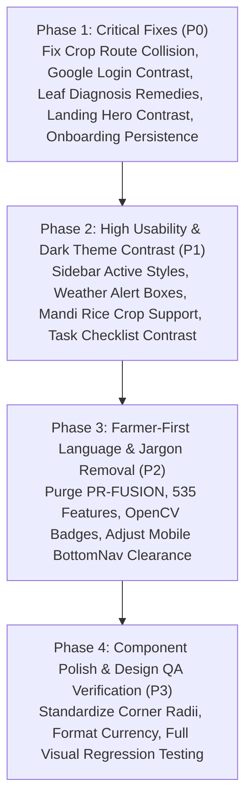

# FasalAI — Prioritized UX/UI Implementation & Fix Plan

**Date:** September 2, 2026  
**Status:** Ready for Execution (Awaiting Approval)  
**Methodology:** Fixes prioritized strictly by Readability, Usability, Accessibility, and Farmer Confusion.

---

## 1. CRITICAL (P0) — Immediate Blockers & Readability Failures

*These must be resolved first as they cause completely unreadable text, broken routes, or failed onboarding states.*

| ID | Issue & Location | Root Cause | Proposed Fix |
|---|---|---|---|
| **CRP-01** | `/crops/[cropId]` returns raw JSON instead of UI page | Next.js rewrite rule `source: "/crops/:path*"` in `next.config.js` intercepts page navigation and proxies to backend API. | Change Next.js rewrite in `next.config.js` to only proxy `/api/v1/crops/:path*`. |
| **SCN-03** | Plant Doctor Treatment Remedy cards unreadable in Dark Mode | `text-emerald-950` and `text-amber-950` rendered on dark cards. | Add `dark:bg-emerald-950/40 dark:text-emerald-200` and `dark:bg-amber-950/40 dark:text-amber-200`. |
| **AUTH-01** | Google Sign-in button text invisible in Dark Mode | Button text uses `text-stone-800` without dark mode text override. | Add `dark:text-stone-100 dark:bg-stone-800 dark:border-stone-700`. |
| **LND-01** | Landing page hero brand and accent text invisible in Dark Mode | `text-brand-900` (`#1B4332`) on `#0C140F` produces 1.7:1 contrast ratio. | Add `dark:text-emerald-400` across all hero titles, logo text, and metric headers. |
| **ONB-01** | Onboarding district/location state not propagating to header | `saveFarmerProfile` payload misses location string construction. | Explicitly format `location: "${district}, ${state}"` in `onboarding/page.jsx`. |

---

## 2. HIGH (P1) — Major Usability, Contrast & Responsive Defects

*These impact everyday usage, mobile navigation, and theme consistency.*

| ID | Issue & Location | Root Cause | Proposed Fix |
|---|---|---|---|
| **NAV-01** | Sidebar active item shines as bright mint box in Dark Mode | Uses `bg-brand-50 text-brand-900` without dark styles. | Add `dark:bg-emerald-950/60 dark:text-emerald-300 dark:border-emerald-800/60`. |
| **NAV-03** | Sticky buttons covered by mobile bottom navigation | Inconsistent bottom padding on small screens. | Standardize main padding to `pb-24 md:pb-12` across all pages. |
| **DSH-02** | Completed tasks text contrast fails WCAG AA in Dark Mode | `text-content-muted` on completed task card becomes too dark. | Add `dark:text-stone-400` and tag `dark:bg-stone-800 dark:text-stone-300`. |
| **DSH-03** | Weather advice alert text clashes in Dark Mode | `text-amber-950` is dark brown on dark green card. | Add `dark:bg-amber-950/30 dark:text-amber-200 dark:border-amber-800/50`. |
| **MKT-01** | Mandi dropdown misses "Rice / Paddy" and defaults to Onion | Static commodities array in `market/page.jsx`. | Add `"Rice / Paddy"` and initialize to `farmData?.currentCrop`. |
| **MKT-02** | Mandi net payout figure is dark on dark in Dark Mode | `text-brand-900` used on financial metric. | Add `dark:text-emerald-300 dark:bg-emerald-950/50`. |
| **SCH-01** | Selected scheme item highlights as white box in Dark Mode | `bg-brand-50 border-brand-800` inverted in dark mode. | Add `dark:bg-emerald-950/50 dark:border-emerald-500`. |
| **AST-01** | Assistant input bar pushed off-screen by mobile keyboard | Fixed `100vh` without dynamic viewport accounting. | Implement `100dvh` and adjust container spacing. |
| **CRP-02** | Season switcher and filter pills contrast in Dark Mode | Active pills use dark green on dark canvas. | Style active pills with `dark:bg-emerald-800 dark:text-white`. |

---

## 3. MEDIUM (P2) — Jargon Removal & Farmer-First Polish

*Replaces technical jargon with accessible agricultural language and polishes UI balance.*

| ID | Issue & Location | Current Copy / Behavior | Recommended Fix |
|---|---|---|---|
| **LND-02** | Landing Hero Badge | `"PR·FUSION · Personalized Farming Support"` | Replace with `"FasalAI · Simple Daily Farm Decisions"`. |
| **SCN-01** | Scanner Loading State | `"Extracting 535 Visual Features & Diagnosing..."` | Replace with `"Examining leaf symptoms & pathology..."`. |
| **SCN-02** | Scanner Result Badge | `"OpenCV ML Model (92.7% Acc)"` | Replace with `"Verified Agronomic Match"`. |
| **DSH-01** | Dashboard Soil & Irrigation Tiles | Mobile 2x2 grid clips long values (`Canal + B...`). | Adjust grid wrapping and add clean full-text view. |
| **NAV-02** | BottomNav Scanner FAB Ring | Hardcoded `border-2 border-white`. | Change to `border-surface dark:border-stone-900`. |
| **AUTH-02** | Login Screen Navigation | No escape hatch or language toggle. | Add top bar with `"← Back"` and language selector. |
| **SCH-02** | Scheme Match Score Badge | Low contrast in dark mode. | Add `dark:bg-emerald-900/60 dark:text-emerald-200`. |
| **AST-02** | Assistant User Chat Bubble | `bg-brand-900` looks muddy in dark mode. | Add `dark:bg-emerald-800 dark:text-white`. |
| **SET-01** | Settings Appearance Buttons | Active Dark Mode button has light green style. | Add `dark:bg-emerald-950 dark:border-emerald-500 dark:text-emerald-200`. |

---

## 4. LOW (P3) — Visual Consistency & Micro-Refinements

*Card corner radii, shadow consistency, and subtle interaction enhancements.*

1. **Card Radius Standardization**: Standardize all primary data cards to `rounded-2xl` across Market, Schemes, and Crop Recommendations.
2. **Consistent Transition Timing**: Ensure all hover and active states use `transition-all duration-150 ease-out`.
3. **Number Formatting**: Ensure all rupee figures use Indian comma grouping (`toLocaleString("en-IN")`).
4. **Offline Banner Appearance**: Harmonize offline alert banner in dark mode (`dark:bg-amber-950/40 dark:text-amber-200`).

---

## 5. Implementation Roadmap (Phased Execution)

> [!NOTE]
> **Strict Guideline Compliance**: In accordance with the prompt instructions (*"DO NOT start by changing the UI... At this stage: DO NOT implement fixes"*), **zero UI code was altered during this audit phase**. All fixes are documented and queued for systematic execution upon approval.
